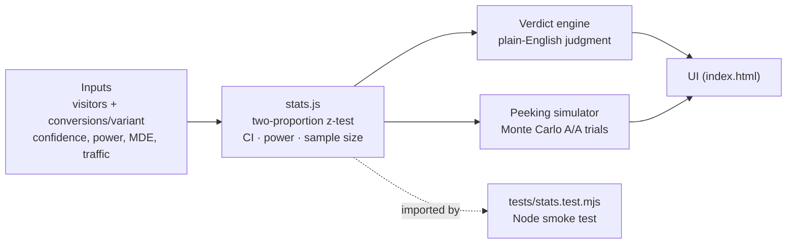
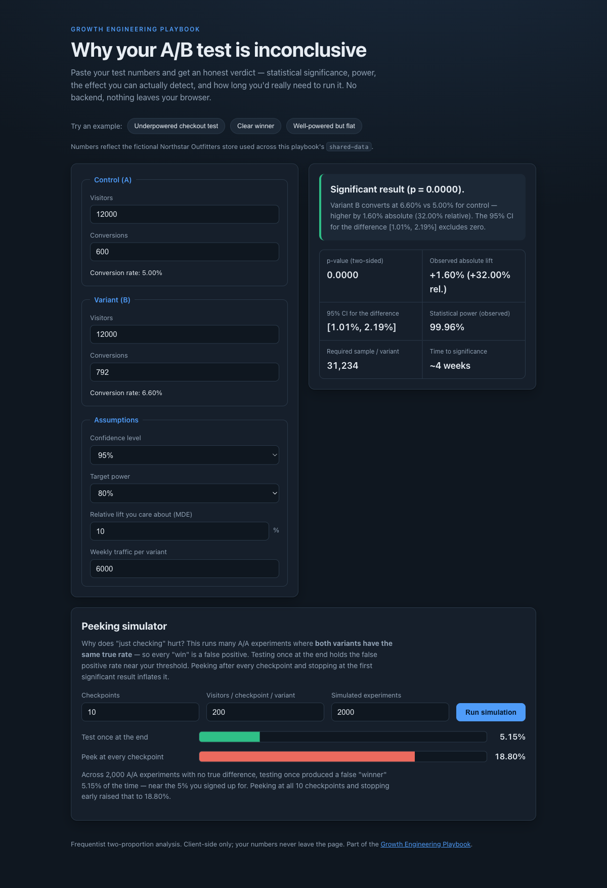

# 01 A/B Test Analyzer

Paste your test numbers and get an honest verdict — statistical significance,
power, the effect you can actually detect, and how long you'd really need to run
the test. A single-page tool that resists false certainty: it will tell you
"not enough evidence yet" when that is the truthful answer.

## Problem

Most e-commerce A/B tests are called too early and on too little traffic. A
team ships a "winning" checkout variant off a 3% lift that was never
statistically distinguishable from noise, or kills a genuinely good idea because
week one looked flat. The usual dashboards report a p-value and a green
checkmark without answering the two questions that actually matter: *do I have
enough evidence?* and *if not, how much longer must I wait?*

## Expertise Signal

Statistical literacy and CRO discipline. The tool makes a professional judgment
visible: **"not enough evidence" is often the most commercially honest answer.**
It separates the observed effect from the confidence in that effect, quantifies
how underpowered a test is, and translates the shortfall into a concrete
"~6 more weeks at your traffic" instead of a false verdict. The built-in peeking
simulator demonstrates *why* repeatedly checking a running test inflates false
positives — a mistake even experienced teams make.

## Business Impact

- **Stops wasted traffic.** Detecting a 10% relative lift on a 5% baseline at
  95%/80% needs ~31,000 visitors *per variant*. A store doing 4,200/variant/week
  that calls the test at week two is acting on noise. This tool shows the gap
  before the decision is made.
- **Prevents both expensive errors.** Shipping a fake winner degrades
  conversion permanently; killing a real winner forfeits recurring revenue.
  Right-sizing the test protects against both.
- **Cheaper decisions.** It answers "should we keep running or stop?" in the
  browser, with no analyst time and no data leaving the page.

## Architecture

Client-side only. No backend, no build step, no data transmission. The
statistics live in one dependency-free module that is imported by both the UI
and the test suite, so the math that ships is the math that is tested.



## Quickstart

Live demo:
[aaronwest-repo.github.io/growth-engineering-playbook/01-ab-test-analyzer](https://aaronwest-repo.github.io/growth-engineering-playbook/01-ab-test-analyzer/)

No dependencies. Serve the folder over HTTP (ES modules don't load from
`file://`) and open it:

```bash
cd 01-ab-test-analyzer
python3 -m http.server 8000
# open http://localhost:8000
```

Run the statistics smoke test:

```bash
cd 01-ab-test-analyzer
node tests/stats.test.mjs
```

## How It Works

Enter visitors and conversions for the control (A) and variant (B). The tool
computes:

- **Significance** — a two-proportion z-test (pooled standard error) giving a
  two-sided p-value.
- **Confidence interval** — the unpooled interval for the absolute difference in
  conversion rate at your chosen confidence level; if it includes zero, you
  can't rule out "no difference".
- **Statistical power** — the post-hoc power to detect the observed effect at the
  current sample size. Low power next to a non-significant result is the
  signature of "we just don't know yet".
- **Required sample size** — visitors per variant needed to detect your target
  relative lift (MDE) at the chosen power/confidence, and — given your weekly
  traffic — how many more weeks that implies.
- **Plain-English verdict** — one of *significant win*, *not enough evidence yet
  (run ~N more weeks)*, or *well-powered but flat (call it and move on)*.

The **peeking simulator** runs many simulated A/A experiments where both
variants share the same true rate, so every "win" is by definition a false
positive. It contrasts testing once at the end (false-positive rate stays near
your 5% threshold) with peeking at every checkpoint and stopping at the first
significant result (false-positive rate balloons).

Example presets use plausible numbers from the fictional **Northstar
Outfitters** store that this playbook's [`shared-data`](../shared-data) is
built around.

## Trade-offs & Scale

Deliberate choices for a small, honest, inspectable tool — and where each one
would break:

- **Fixed-horizon frequentist test, not sequential.** The math assumes you
  decide the sample size up front and test once. That is exactly why the peeking
  simulator exists — to show the cost of violating it. A team that genuinely
  needs to stop early should use a sequential design (e.g. mSPRT / group
  sequential with alpha-spending) or a Bayesian approach; this tool intentionally
  does *not* pretend continuous monitoring is free.
- **Normal approximation to the binomial.** The z-test and the Wald confidence
  interval are accurate at e-commerce sample sizes but degrade when conversions
  are tiny (say < ~15 per arm) or rates are near 0/100%. At that scale you want
  an exact/Fisher test or a Wilson interval; here the honest move is that the
  tool reports low power rather than a misleading interval.
- **Single metric, single comparison.** One control vs one variant, one
  conversion rate. Multi-variant tests need multiple-comparison correction; a
  revenue-per-visitor metric is heavier-tailed than a proportion and needs a
  different variance model. Both are out of scope by design — adding them without
  the correction would produce confident-looking wrong answers.
- **Post-hoc "observed power".** Useful here as a plain-language "how sure are
  we" signal, but observed power is a known-flawed concept for *justifying* a
  result after the fact. The required-sample-size calculation (an a-priori
  design input) is the number to plan around; observed power is only a
  diagnostic.
- **No persistence / no accounts.** State lives in the page. For a team that
  wants to track many tests over time you'd add storage and an experiment
  registry — but that is a different product, not this demo.

## Blog Links

Part of the Experimentation & CRO article cluster on
[aaronwest.de/blog](https://aaronwest.de/blog):

- *Why Most A/B Tests Are Inconclusive* — placeholder link, article pending:
  [aaronwest.de/blog/why-most-ab-tests-are-inconclusive](https://aaronwest.de/blog/why-most-ab-tests-are-inconclusive)
- *What to Test When You Don't Have the Traffic* — placeholder link, article
  pending:
  [aaronwest.de/blog/what-to-test-without-traffic](https://aaronwest.de/blog/what-to-test-without-traffic)

## Screenshot


