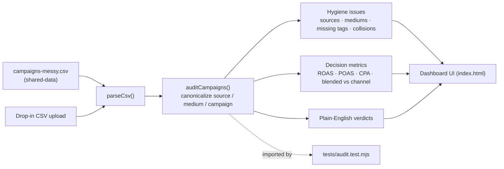
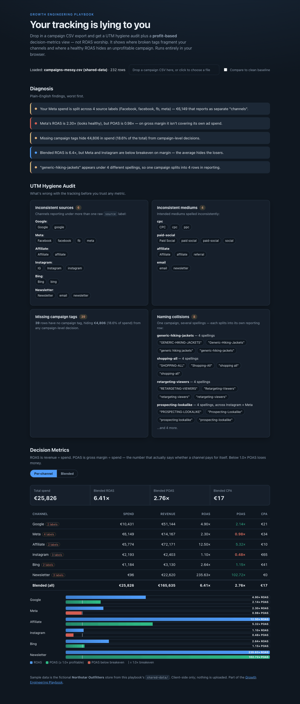

# 02 UTM Audit Dashboard

Drop in a campaign CSV export and get a UTM hygiene audit plus a **profit-based**
decision-metrics dashboard — not ROAS worship. It shows where broken tags
fragment your channels, and where a healthy-looking ROAS hides a campaign that
isn't actually paying for itself.

## Problem

Marketing dashboards are only as honest as the UTM tags feeding them. In a
typical export, one channel arrives under four different `source` spellings,
mediums are a mix of `cpc`/`CPC`/`ppc`, a chunk of spend has no campaign tag at
all, and the same campaign appears under several casings. On top of that, teams
optimize to **ROAS** (revenue ÷ spend) — a vanity metric that ignores margin.
The result: budget decisions made on numbers that are quietly wrong.

## Expertise Signal

Moves performance marketing from *channel reporting* to *decision-quality
measurement*. The tool audits the tracking **before** it trusts any metric, then
reframes performance around **POAS** (gross margin ÷ spend) — the number that
says whether a channel pays for itself. It makes the vanity-vs-decision-metric
argument tangible instead of theoretical.

## Business Impact

Run against the bundled sample (`campaigns-messy.csv`, €25,826 spend), the audit
surfaces decisions that ROAS-first reporting would get wrong:

- **A "winning" channel that loses money.** Meta shows a **2.30× ROAS** (looks
  fine) but **0.98× POAS** — on gross margin it doesn't cover its own ad spend.
  Instagram is worse at **0.48× POAS**. Scaling either on ROAS burns margin.
- **Spend fragmented across labels.** Meta's **€6,149** is split across **4**
  source labels (`Facebook`, `facebook`, `fb`, `meta`), so no single row shows
  the channel's true position.
- **Budget hidden from decisions.** **€4,806 (18.6% of spend)** has no campaign
  tag, so it can't be judged at the campaign level at all.
- **The blend lies.** Blended ROAS is **6.41×** — healthy — while POAS is
  **2.76×** and two paid channels are underwater. The average hides the losers;
  the real profit engine is Affiliate (**5.32× POAS**), not the paid social that
  gets the credit in a ROAS view.

## Architecture

No backend, no build step. The audit logic is one dependency-free module shared
by the browser UI and the Node smoke test.



## Quickstart

The app reads the shared sample from `../shared-data/`, so serve the **repo
root** (not the use-case folder) over HTTP:

```bash
# from the repository root
python3 -m http.server 8000
# then open http://localhost:8000/02-utm-audit-dashboard/
```

Or just drag any campaign CSV onto the drop zone — nothing is uploaded, it runs
entirely in the browser. Live demo (after deploy):
`https://aaronwest-repo.github.io/growth-engineering-playbook/02-utm-audit-dashboard/`

Run the audit smoke test:

```bash
cd 02-utm-audit-dashboard
node tests/audit.test.mjs
```

## How It Works

1. **Load** — defaults to `shared-data/marketing/campaigns-messy.csv`; a
   drop-zone/file-picker accepts any campaign CSV with the same columns.
2. **Canonicalize** — each `source`, `medium`, and `campaign` is normalized
   (casing, whitespace, separators, known aliases like `fb`/`meta` → Meta) to
   its intended value, so variants collapse to one channel/campaign.
3. **Audit** — reports inconsistent sources, inconsistent mediums, missing
   campaign tags (with the spend they hide), and naming collisions (one campaign
   under several spellings, including collisions across sources).
4. **Decide** — computes ROAS, **POAS** (gross margin ÷ spend), and CPA per
   canonical channel and blended, flags any channel below **1.0× POAS**, and
   charts ROAS vs POAS against the breakeven line.
5. **Verdicts** — plain-English findings, worst first ("Your Meta spend is split
   across 4 source labels…", "ROAS looks healthy, but POAS shows…").
6. **Baseline** — an optional toggle re-audits `campaigns-clean.csv` to show what
   the same spend looks like under governed tracking (zero issues).

The sample universe is the fictional **Northstar Outfitters** store this
playbook's [`shared-data/`](../shared-data) is built around. Shared files are
read only, never modified.

## Trade-offs & Scale

Deliberate boundaries for a small, honest, inspectable tool:

- **CSV demo, not a live analytics API.** Real use would pull from GA4 / an ad
  platform API (auth, pagination, sampling, schema drift). The audit logic is
  the transferable part; the ingestion is intentionally a static CSV here.
- **Heuristic normalization, not a governed taxonomy.** Alias maps
  (`fb`→Meta, `ppc`→cpc) are a diagnostic bandage. The real fix is a tracking
  spec enforced at tag-creation time; this tool is what you run *before* that
  exists, to prove why you need it.
- **POAS uses gross margin, not full contribution margin.** It omits shipping,
  payment fees, returns, and fulfilment. So real per-order profitability is
  *lower* than POAS shows — the channels flagged as underwater are, if anything,
  understated.
- **Last-click / channel-level reporting.** Each row is credited to its own
  UTM. There is no multi-touch or incrementality modelling, so assisted
  conversions and channel overlap aren't captured — fine for hygiene and
  first-order profitability, not for final budget reallocation.
- **No consent-mode / modeled conversions.** Under consent banners, a share of
  conversions are modeled or missing upstream; this tool treats the CSV as
  ground truth and does not attempt to model gaps yet.

## Blog Links

Part of the Performance Marketing article cluster on
[aaronwest.de/blog](https://aaronwest.de/blog). Related articles are pending:

- *Your Tracking Is Lying to You: A UTM Hygiene Audit*
- *ROAS vs POAS: Optimizing to the Wrong Number*

## Screenshot


