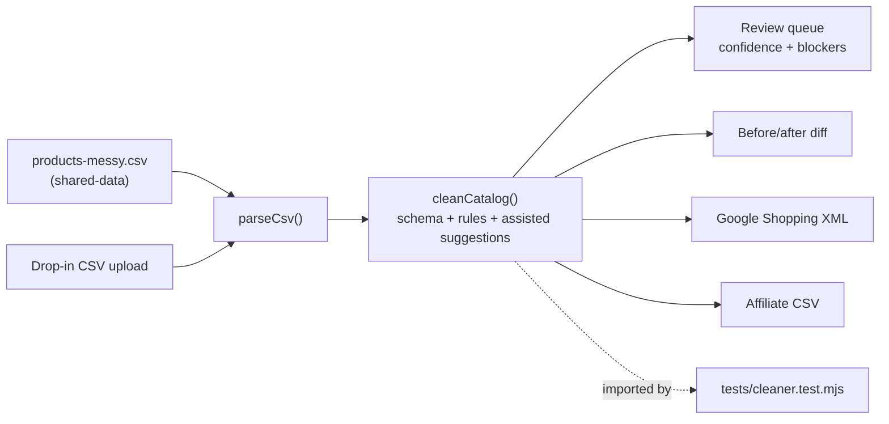
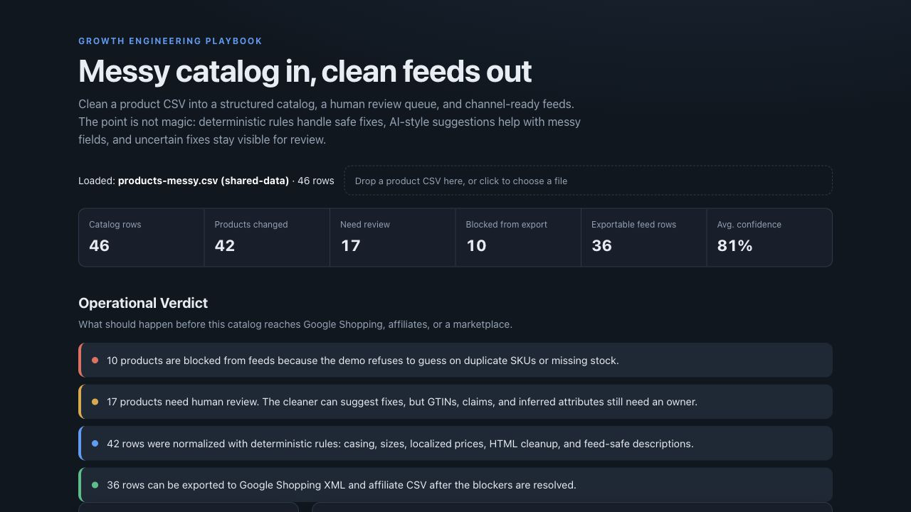

# 03 Product Data Cleaner

Clean a realistically messy product CSV into a structured catalog, a human
review queue, and channel-ready feeds. The demo shows the practical middle
ground between brittle spreadsheet cleanup and blind AI automation: rules handle
safe fixes, AI-style suggestions help with unstructured fields, and uncertain
changes stay visible for review.

## Problem

Product feeds fail quietly. A catalog can look usable in a spreadsheet while
Google Shopping, affiliate partners, marketplaces, and on-site search see a
different reality: missing GTINs, duplicate SKUs, localized prices, HTML in
descriptions, mixed languages, inconsistent variants, and product claims that
should never be syndicated.

The commercial damage is not just a rejected feed. It is budget and operational
work wasted on campaigns whose product data cannot be trusted.

## Expertise Signal

This demo treats catalog cleaning as an operating system, not a one-click AI
trick. It separates:

- **Safe deterministic fixes**: casing, size normalization, localized price
  parsing, HTML removal, and channel-specific feed formatting.
- **Assisted suggestions**: missing color/material inferred from sibling
  variants and descriptions rewritten away from unsupported claims.
- **Human review gates**: duplicate SKUs, missing stock, missing GTINs,
  language bleed, and low-confidence inferred attributes.

That distinction is the professional judgment: AI can accelerate catalog ops,
but it should not silently invent identifiers, stock, or claims.

## Business Impact

Against the bundled Northstar Outfitters sample, the cleaner finds:

- **46 catalog rows** inspected.
- **42 products changed** by deterministic normalization or assisted cleanup.
- **17 products requiring review** before feed syndication.
- **10 products blocked from export** because of duplicate SKUs or missing stock.
- **36 exportable feed rows** for Google Shopping XML and affiliate CSV.
- **10 missing GTINs**, **6 missing colors**, **6 missing materials**, **5
  localized euro prices**, **4 unsupported claim descriptions**, and **2 duplicate
  SKU rows**.

The value is avoiding bad automation: the demo exports only rows that pass the
minimum feed gate and makes the rest visible to a merchandiser or marketing ops
owner.

## Architecture



## Quickstart

The app reads the sample catalog from `../shared-data/`, so serve the **repo
root** over HTTP:

```bash
# from the repository root
python3 -m http.server 8000
# then open http://localhost:8000/03-product-data-cleaner/
```

Or drag any product CSV onto the drop zone. The expected columns match the
shared catalog:

```text
product_id,parent_id,sku,title_en,title_de,brand,category,price,currency,
margin_rate,stock,size,color,material,weight_grams,description_en,
description_de,image_url,gtin,availability,condition,google_product_category
```

Run the smoke test:

```bash
cd 03-product-data-cleaner
node tests/cleaner.test.mjs
```

## How It Works

1. **Load** - defaults to `shared-data/catalog/products-messy.csv`; a drop-zone
   accepts a CSV with the same product columns.
2. **Normalize** - canonicalizes brand/category casing, clothing and shoe sizes,
   localized euro prices, HTML fragments, and feed-safe text fields.
3. **Assist** - suggests missing color/material from sibling variants in the
   same product family and rewrites unsupported claim descriptions into
   structured, factual copy.
4. **Score** - every product receives a confidence score and a status:
   `export_ready`, `review`, or `blocked`.
5. **Review** - missing GTINs, language bleed, inferred attributes, duplicate
   SKUs, and missing stock stay visible in a human review queue.
6. **Export** - products that are not blocked can be exported as Google Shopping
   XML or a generic affiliate CSV.

The browser UI and the Node smoke test import the same `cleaner.js` module, so
the logic shown in the demo is the logic under test.

## Trade-offs & Scale

- **Deterministic AI-assist, not a live LLM.** The demo simulates the useful
  pattern - extracting/suggesting attributes and rewriting risky claims - with
  deterministic rules so GitHub Pages works without a model download. In
  production, the assisted step could call an LLM, but outputs would still need
  schema validation, confidence scoring, and review gates.
- **Family inference is intentionally conservative.** Missing color/material are
  suggested from sibling variants, not treated as truth. This is useful for
  finding likely fixes, but catalog teams still need to verify variant-specific
  attributes.
- **Blocked means blocked.** Duplicate SKUs and missing stock are excluded from
  feed exports. A real system might route these to a PIM, ERP, or merchandiser
  task queue instead of just showing them in-browser.
- **Feed contracts are simplified.** Google Shopping XML and affiliate CSV
  previews demonstrate channel-specific output, but real feeds add country,
  shipping, tax, sale price, image policy, custom labels, identifier exemption,
  and partner-specific validation rules.
- **No persistence.** This is a portfolio demo, so review decisions are not
  saved. Production usage would need audit history, owner assignment, approvals,
  and feed publishing logs.

## Blog Links

Part of the Catalog & Product Data and AI in Practice article clusters on
[aaronwest.de/blog](https://aaronwest.de/blog). Related articles are pending:

- *Cleaning Messy Product Data With AI*
- *Product Feeds for Every Channel*
- *Structured Product Data*
- *Variants, Attributes, and the Data Model*
- *Affiliate Product Feeds: The Boring File That Makes the Money Move*

## Screenshot


