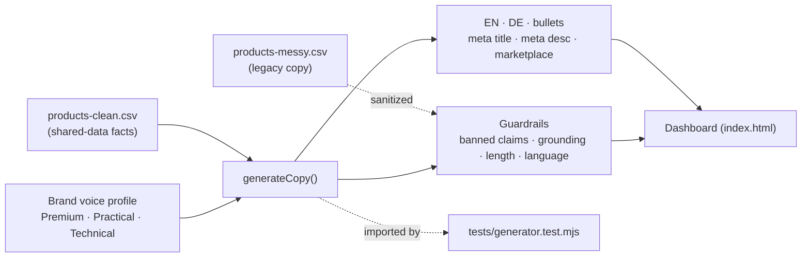
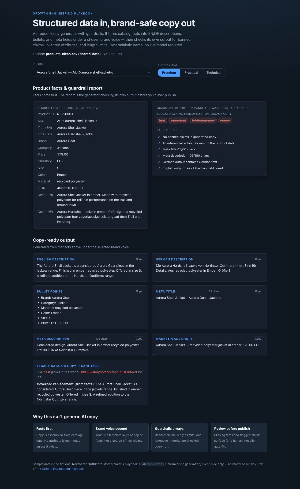

# 04 Product Description Generator

Structured product data in, brand-safe product copy out — **with guardrails**.
This is not a generic AI copywriter. It demonstrates prompt/product thinking:
facts first, brand voice second, and guardrails (banned claims, invented
attributes, length limits, language integrity) on every run.

## Problem

"Generate product descriptions with AI" is easy to demo and dangerous to ship.
Left ungoverned, it produces SEO sameness (every product sounds identical),
hallucinated attributes (a color or material the product doesn't have),
product-claim risk ("100% waterproof", "guaranteed for life"), and brand
dilution. The hard part isn't generating text — it's generating text that
respects the product data and the brand's legal boundaries.

## Expertise Signal

Treats copy generation as a governed workflow, not a text faucet. It separates
**facts** (from the catalog) from **voice** (a template layer) from
**guardrails** (always applied), and surfaces anything uncertain for human
review instead of silently inventing it. That is the difference between someone
who has *used* an LLM and someone who can put one into production safely.

## Business Impact

The value is not "more text, faster" — it's **governed copy that respects
product data**. Against the bundled catalog:

- **Claim risk is caught, not shipped.** For the Aurora Shell Jacket, the legacy
  catalog copy carries four banned claims (`best`, `guaranteed`,
  `100% waterproof`, `forever`); the guardrail blocks all four and rebuilds the
  copy from facts.
- **No hallucinated attributes.** If `color` or `material` is missing, the
  generator omits it and raises a review warning — it never fills the gap with
  an invented value.
- **Feed-safe by construction.** Meta title stays ≤ 60 chars, meta description
  ≤ 160, so output doesn't get truncated in search results or rejected by feeds.
- **Consistent EN + DE** for multilingual catalogs, with a check that German
  output isn't accidentally English and English output has no German field bleed.

Avoiding one wrongful "waterproof"/"guaranteed" claim across a catalog is worth
more than the copywriting time saved.

## Architecture

Deterministic, client-side, no backend. The generation + guardrail core is one
dependency-free module shared by the UI and the smoke test.



## Quickstart

The app reads the sample catalog from `../shared-data/`, so serve the **repo
root** over HTTP:

```bash
# from the repository root
python3 -m http.server 8000
# then open http://localhost:8000/04-product-description-generator/
```

**Live demo:**
[aaronwest-repo.github.io/growth-engineering-playbook/04-product-description-generator](https://aaronwest-repo.github.io/growth-engineering-playbook/04-product-description-generator/)

Run the smoke test:

```bash
cd 04-product-description-generator
node tests/generator.test.mjs
```

## How It Works

1. **Load facts** — parses `products-clean.csv`; a product selector lists all 46
   Northstar Outfitters items with their real fields (SKU, titles, brand,
   category, price, size, color, material, GTIN, descriptions).
2. **Pick a voice** — Premium, Practical, or Technical. The voice changes tone
   and framing (a template layer), never the underlying facts.
3. **Generate** — EN + DE descriptions, bullet points, meta title, meta
   description, and a marketplace-short line, assembled *only* from present facts.
4. **Guardrail** — the generator checks its own output: no banned claims,
   every referenced attribute exists in the data, meta lengths within limits,
   German output is actually German, English has no German bleed. Missing facts
   become warnings, not invented values.
5. **Sanitize legacy copy** — for the selected product it also pulls the messy
   catalog's existing description and shows which banned claims it would strip,
   next to a governed replacement built from facts.

Because it's deterministic, the same product + voice always produces the same
copy — which is what makes the guardrails testable in CI.

## Why deterministic instead of a live model

This version **does not call OpenAI or Ollama**. It simulates the *architecture*
of an LLM copy workflow — structured input → voice-conditioned generation →
guardrail pass → human review — while staying fully inspectable on GitHub Pages
with no model download or API key. In a production build, the generation step
would call a model behind the same guardrail contract; the guardrails and the
facts-first discipline are the part that matters and the part on show here.

## Trade-offs & Scale

- **Deterministic generator, not a real LLM.** Chosen so the demo runs on
  GitHub Pages with zero setup. A production version swaps the generation step
  for a model call but keeps the identical guardrail layer around it.
- **Guardrails catch obvious unsupported claims, not everything.** A fixed
  banned-phrase list and length/grounding checks are a safety net, not a
  substitute for legal/compliance review of regulated claims.
- **Structured-data dependency.** Weak inputs produce weak copy: if the catalog
  lacks material/color, the tool correctly refuses to invent them, so the output
  is thinner. Copy quality is capped by data quality (see use case #3).
- **DE/EN is template-assisted, not translation memory.** German output is
  generated from German fields and templates, not a professional TM or reviewed
  glossary; it's suitable for draft, not final localized copy.
- **No persistence or review workflow yet.** Output is copy-ready on screen but
  there's no approval queue, versioning, or write-back to a PIM/feed.

## Blog Links

Part of the AI & Product Content cluster on
[aaronwest.de/blog](https://aaronwest.de/blog). Articles pending:

- *AI for Product Descriptions That Don't Sound Generic*
- *Product Descriptions: Writing for the Customer and the Machine*
- *AI Hallucination: Why "Sounds Right" Isn't "Is Right"*
- *Brand Voice in AI Workflows*
- *Structured Product Data as the Real AI Moat*

## Screenshot


