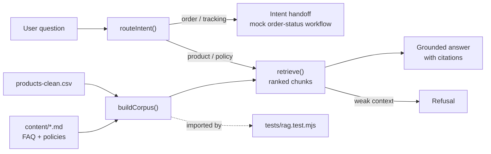
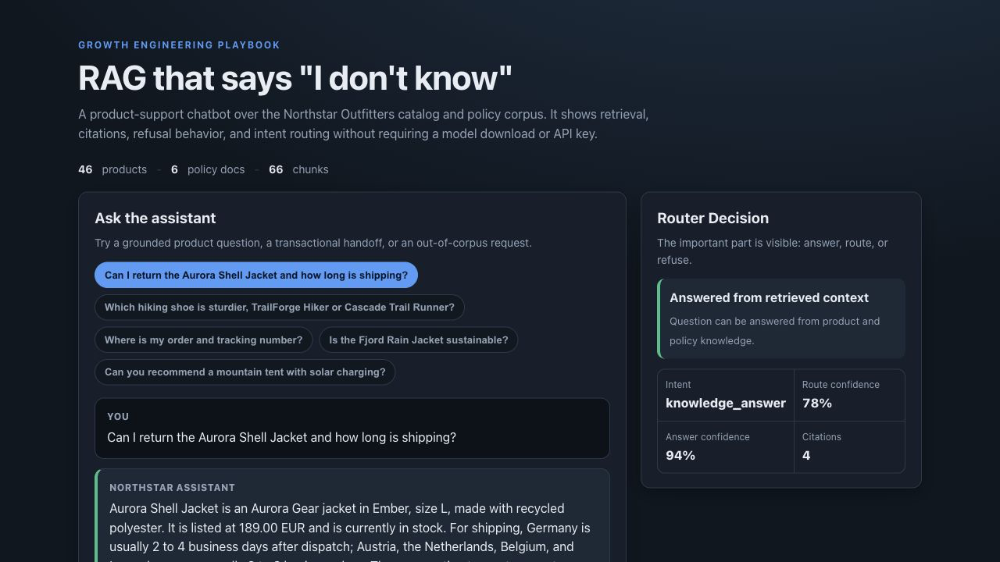

# 05 RAG Product Chatbot

A product-support chatbot over the fictional Northstar Outfitters catalog and
policy corpus. It demonstrates the architecture that keeps chatbots useful:
retrieval, citations, refusal behavior, and intent routing. It does not call a
live model in this version, so the demo is inspectable on GitHub Pages without
Ollama, API keys, or a model download.

## Problem

Most e-commerce chatbot demos answer confidently even when the source data does
not support the answer. That is exactly the failure mode customers and operators
notice: invented delivery promises, fake sustainability claims, made-up product
attributes, or a bot pretending it can check a live order.

The real work is not a chat box. It is deciding what the bot is allowed to know,
when it must cite sources, when it must refuse, and when it should route to a
workflow instead of generating text.

## Expertise Signal

This demo makes the invisible parts visible:

- **Retrieval**: product and policy chunks are scored and shown.
- **Citations**: answers cite the exact product or policy section used.
- **Refusal**: out-of-corpus questions get a grounded "I do not know."
- **Intent routing**: order/tracking/payment questions route to a mocked
  transactional workflow instead of a generative answer.
- **Claim discipline**: warranty and sustainability answers avoid unsupported
  "guaranteed for life" or certification language.

That is the senior signal: a useful chatbot is a system of constraints, not a
textarea attached to a model.

## Business Impact

For an e-commerce operator, the value is fewer bad answers and fewer hidden risk
paths:

- Product answers cite catalog rows, not memory.
- Shipping and returns answers cite policy sections, not vague promises.
- Order-status questions do not pretend to access private transactional data.
- Weak retrieval refuses instead of hallucinating.
- The retrieved context is inspectable, so support, merchandising, and legal can
  reason about what the assistant is allowed to say.

This connects directly to the blog's chatbot and AI-concepts clusters: RAG,
intent-based bots, hallucination, AI agents, and practical support automation.

## Architecture



## Quickstart

The app reads shared catalog and policy files, so serve the **repo root** over
HTTP:

```bash
# from the repository root
python3 -m http.server 8000
# then open http://localhost:8000/05-rag-product-chatbot/
```

Run the smoke test:

```bash
cd 05-rag-product-chatbot
node tests/rag.test.mjs
```

## How It Works

1. **Build corpus** - loads 46 products from `products-clean.csv` and 6 markdown
   policy documents from `shared-data/content/`.
2. **Chunk** - each product becomes a product chunk; each markdown section
   becomes a policy chunk.
3. **Route** - transactional questions such as order status, tracking, invoice,
   or payment route to an intent handoff.
4. **Retrieve** - product/policy questions use lexical retrieval with
   source-aware boosts so policy questions include policy context, not just
   product variants.
5. **Answer** - deterministic answer synthesis uses only retrieved product and
   policy facts and returns citations.
6. **Refuse** - weak or out-of-corpus retrieval returns a clear grounding limit
   instead of a confident guess.

The browser UI and the Node smoke test import the same `rag.js` module.

## Trade-offs & Scale

- **Deterministic RAG, not a live LLM.** This version shows the architecture
  without requiring Ollama or a paid API. A production version would replace the
  deterministic answer composer with a model call, but keep the same retrieval,
  routing, citations, and refusal gates.
- **Lexical retrieval, not embeddings.** The demo uses token scoring and
  source-aware boosts so it stays dependency-free. At scale, embeddings and a
  vector index would improve semantic recall, but they would still need source
  diversity and thresholding.
- **No authenticated order lookup.** Order, tracking, invoice, and payment
  questions route to an intent handoff. A real bot would call an authenticated
  order API after verifying the customer.
- **Policy corpus is small.** Six documents are enough to demonstrate RAG
  mechanics. Real support bots need ownership, freshness checks, versioning, and
  a publishing workflow for policy changes.
- **Citations are necessary, not sufficient.** Showing sources helps trust, but
  regulated claims, warranty approval, and sustainability language still require
  human-owned policy.

## Blog Links

Part of the Chatbots and AI Concepts clusters on
[aaronwest.de/blog](https://aaronwest.de/blog). Related articles include:

- *What Is Retrieval-Augmented Generation?*
- *Intent-Based vs Generative Chatbots*
- *Why AI Hallucinates*
- *What Is an AI Agent?*
- *Chatbots for E-Commerce: What They Should and Should Not Do*

## Screenshot


