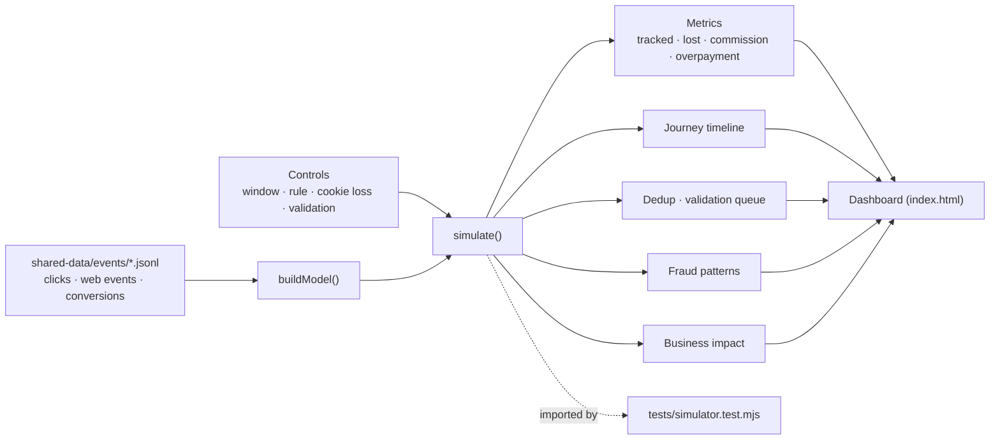
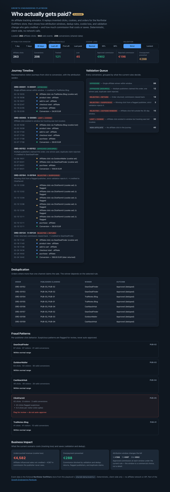

# 06 Affiliate Tracking Simulator

**Wave 1 flagship.** Clicks, cookies, conversions, deduplication, validation,
and fraud patterns made visible. Not a generic attribution dashboard — a
working model of *how affiliate tracking actually decides who gets paid*, and
what each rule choice costs or saves.

## Problem

Affiliate tracking fails quietly. A cookie is dropped and a real affiliate sale
goes uncredited. Two publishers claim the same order. A conversion lands 40 days
after the click. An order is returned after commission is booked. A publisher
sends thousands of clicks and almost no real sales. None of this shows up as a
red number on a dashboard — it shows up as revenue you under-count and
commission you over-pay, at the same time.

## Expertise Signal

Deep affiliate-domain judgment made inspectable. The simulator separates the raw
event log (clicks, on-site events, orders) from the *decision engine*
(attribution window, attribution rule, cookie-loss model, validation mode) and
shows the working: the journey timeline, who wins a disputed order, why a claim
is rejected, and which publisher to hold for review. It treats attribution as a
commercial decision with money attached, not a setting.

## Business Impact

Tracking failure costs money in **both** directions. On the bundled sample
(30-day window, last-affiliate rule, strict validation):

- **Under-counting from tracking loss.** Cookie-loss journeys leave **~€4,582**
  of affiliate-influenced revenue uncredited — commission the publisher earned
  but never sees, and a channel that looks worse than it is. Turn cookie loss to
  60% and tracked conversions collapse from ~121 to ~12.
- **Over-payment prevented by validation + dedup.** Returns, flagged publishers,
  and duplicate claims account for **~€288** of commission that weak validation
  would have paid out in error.
- **The attribution window is a bill, not a detail.** Approved commission on the
  same data runs **~€188 (1-day) → ~€697 (7-day) → ~€902 (30-day)**. Picking a
  window is choosing how much to pay.

The point isn't a prettier report — it's seeing where the money leaks before you
sign the publisher payout.

## Architecture

Deterministic, client-side, no backend. The engine is one dependency-free module
shared by the UI and the smoke test; the event data is generated into
`shared-data/events/` by the repo's seed script.



## Quickstart

The app reads events from `../shared-data/`, so serve the **repo root**:

```bash
# from the repository root
python3 -m http.server 8000
# then open http://localhost:8000/06-affiliate-tracking-simulator/
```

**Live demo:**
[aaronwest-repo.github.io/growth-engineering-playbook/06-affiliate-tracking-simulator](https://aaronwest-repo.github.io/growth-engineering-playbook/06-affiliate-tracking-simulator/)

Regenerate the event data (deterministic):

```bash
python3 scripts/generate-shared-data.py
```

Run the smoke test:

```bash
cd 06-affiliate-tracking-simulator
node tests/simulator.test.mjs
```

## How It Works

1. **Raw events** — `affiliate-clicks.jsonl`, `web-events.jsonl`, and
   `conversions.jsonl` are invented but internally consistent: 5 publishers
   (one, `ClickFarmX`, deliberately suspicious), varied click→conversion gaps,
   cookie-loss journeys, cross-channel disputes, duplicate claims, returns, and
   out-of-window sales.
2. **Attribution window** (1/7/30 days) — a conversion is only credited if a
   tracked affiliate click sits inside the window. Widening it credits more.
3. **Attribution rule** — last affiliate click, first affiliate click, or last
   paid touch. Last-paid-touch hands cross-channel orders to paid search and
   drops affiliate credit.
4. **Cookie-loss mode** — layers extra ITP-style loss on top of the clicks that
   already lost their cookie, deterministically, so higher loss = fewer tracked
   sales.
5. **Validation mode** — strict rejects flagged-publisher conversions; lenient
   approves them with a flag. Both reject returns and resolve duplicates.
6. **Outputs** — top-line metrics, a journey timeline per outcome type, a dedup
   table, a validation queue grouped by decision, a per-publisher fraud panel,
   and a business-impact panel that recomputes as you change controls.

## Trade-offs & Scale

- **Deterministic simulator, not a real network/server-side postback.** There's
  no S2S, no pixel, no real click redirect. It models the *decisions* a tracking
  stack makes, not the transport.
- **Simplified attribution models.** Three rules and a single window; real
  programs layer voucher rules, new-vs-returning logic, and category caps.
- **Cookie-loss is simulated, not ITP-accurate.** It's a deterministic hash
  knob, not a browser-accurate model of Safari/Firefox cookie lifetimes.
- **Fraud detection is pattern-based, not proof.** Click spikes, poor session
  quality, and impossible timing *flag for review* — they don't prove fraud, and
  the tool never auto-rejects a publisher on signals alone.
- **The validation queue is illustrative, not an accounting system.** No
  ledger, clawback workflow, or payout export.
- **No real affiliate network API.** Publisher IDs, orders, and commissions are
  invented Northstar Outfitters data.

## Blog Links

Part of the Affiliate & Attribution cluster on
[aaronwest.de/blog](https://aaronwest.de/blog). Articles pending:

- *How Affiliate Tracking Actually Works*
- *Affiliate Deduplication: Who Wins the Order*
- *S2S and Postback Tracking*
- *Why You're Under-Counting Affiliate Revenue*
- *Affiliate Deeplinks*
- *Affiliate Fraud: Patterns, Not Proof*
- *Attribution for Affiliate Marketing*

## Screenshot


