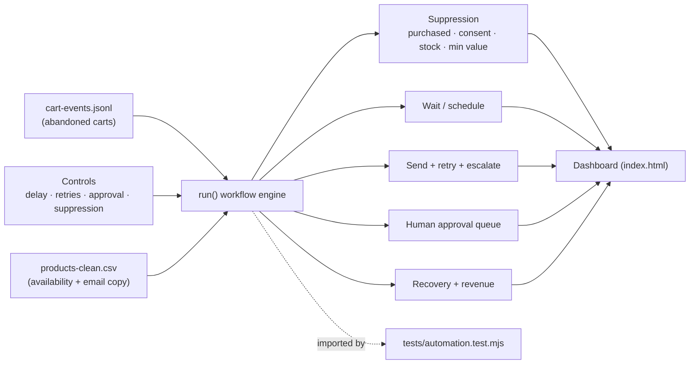
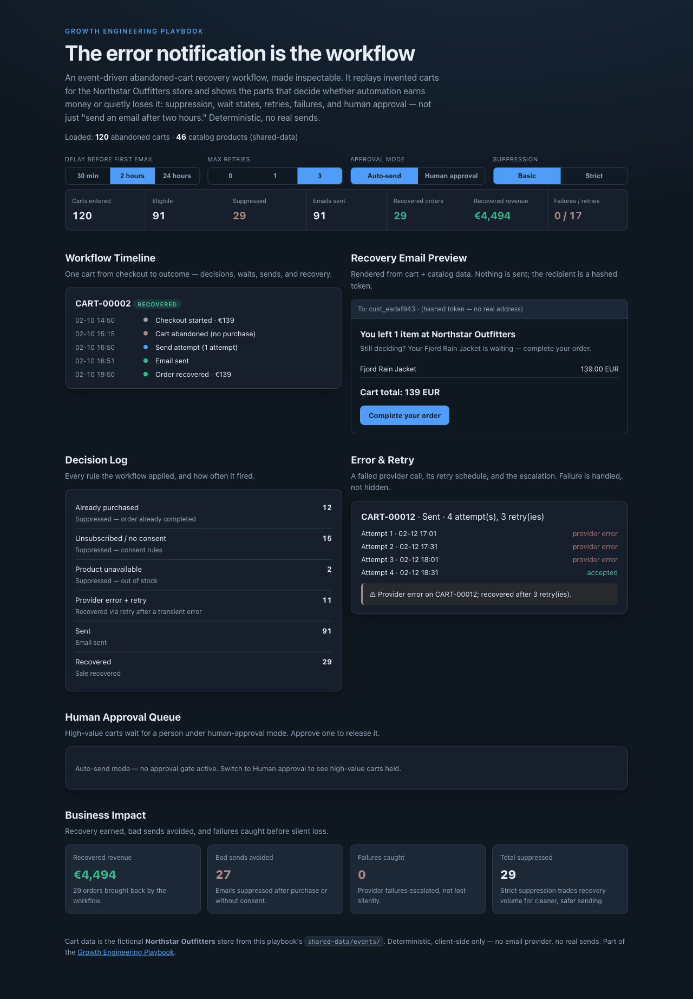

# 07 Cart Recovery Automation

Event-driven abandoned-cart recovery with suppression rules, wait states,
retries, rendered emails, human approval gates, and operational alerts — the
whole workflow, made inspectable. Not "send an email after two hours."

## Problem

Cart-recovery automation is easy to switch on and easy to get wrong. Badly built,
it emails people who already bought, ignores unsubscribe/consent, spams
high-value customers with no review, and — worst of all — fails silently when
the email provider errors, so nobody notices the recovery revenue quietly
stopped. The value isn't more emails; it's a workflow you can trust to *not*
send the wrong thing and to *tell you* when it breaks.

## Expertise Signal

Automation architecture judgment. The demo treats a recovery flow as an
event-driven system with real edges: trigger events, eligibility and suppression
rules, wait/delay logic, retry with backoff, failure handling with escalation,
and human approval for risky sends. It embodies the principle that **the error
notification is part of the workflow** — a send that fails and alerts is a
success of design; a send that fails silently is the real bug.

## Business Impact

Recovery only makes money when the workflow is trustworthy. On the bundled
sample (120 abandoned carts, 2-hour delay, 3 retries, auto-send, basic
suppression):

- **Recovered revenue: ~€4,494** across ~29 orders the workflow brought back.
- **Bad sends avoided: ~27** — emails suppressed because the shopper already
  purchased or hadn't consented. Every one of those is a complaint, an
  unsubscribe, or a compliance risk not created.
- **Failures caught, not lost.** Provider errors are retried with backoff and,
  if still failing, escalated with an alert — instead of silently dropping
  recovery revenue.
- **Suppression is a dial, not a default.** Strict suppression roughly halves
  emails sent (and recovered revenue) in exchange for cleaner, safer,
  consent-first sending — a deliberate trade, shown side by side.

## Architecture

Deterministic, client-side, no backend and no email provider. The workflow
engine is one dependency-free module shared by the UI and the smoke test; the
abandoned carts come from `shared-data/events/cart-events.jsonl`.



## Quickstart

The app reads events from `../shared-data/`, so serve the **repo root**:

```bash
# from the repository root
python3 -m http.server 8000
# then open http://localhost:8000/07-cart-recovery-automation/
```

Run the smoke test:

```bash
cd 07-cart-recovery-automation
node tests/automation.test.mjs
```

## How It Works

1. **Trigger** — each abandoned cart enters the workflow with its value, items,
   consent status, and (invented) provider-reliability seed.
2. **Suppression** — the cart is dropped, with a reason, if the shopper already
   purchased, is unsubscribed (strict mode also drops unknown consent), a
   product is out of stock, or the cart is below the minimum value.
3. **Wait** — the send is scheduled at abandonment + the chosen delay (30 min /
   2 h / 24 h).
4. **Approval** — high-value carts (≥ €150) send automatically in auto mode, or
   wait in the human-approval queue until an operator releases them.
5. **Send + retry** — a provider error triggers retries with backoff up to the
   chosen max; if it still fails, the run is marked failed **and raises an
   alert** rather than disappearing.
6. **Recovery** — a successfully emailed cart with recover propensity returns and
   completes the order; its value is booked as recovered revenue.
7. **Panels** — metrics, a per-cart workflow timeline, a decision log, a rendered
   email preview (recipient is a hashed token, never a real address), an
   error/retry panel with the escalation, the approval queue, and a
   business-impact summary that recomputes as you change controls.

## Trade-offs & Scale

- **Deterministic event simulator, not a live webhook service.** There's no real
  event bus, queue, or cron; the engine replays a fixed cart set. It models the
  *decisions*, not the infrastructure.
- **No real email provider.** Sends are simulated and rendered on screen; nothing
  leaves the browser and there are no real addresses.
- **Simplified consent model.** Three states (subscribed / unknown /
  unsubscribed); a real system carries granular consent, regional rules, and
  frequency capping.
- **Local approval queue, no persistence.** Approvals live in the page for the
  session; a production queue needs storage, auth, and an audit trail.
- **Revenue attribution is illustrative.** Recovered revenue equals cart value
  for carts flagged to recover; real attribution needs a holdout/control and
  decay, not a flag.
- **Retry model is simplified.** Fixed backoff and a per-cart "succeeds on
  attempt N"; real providers need idempotency keys, jitter, and dead-letter
  handling.

## Blog Links

Part of the Automation & CRM cluster on
[aaronwest.de/blog](https://aaronwest.de/blog). Articles pending:

- *Post-Purchase Is the Most Under-Automated Moment*
- *Webhooks, APIs and Triggers*
- *The Error Notification Is the Workflow*
- *Five Things You Should Never Automate*
- *Automation Is Not the Tool, It Is the Process*

## Screenshot


