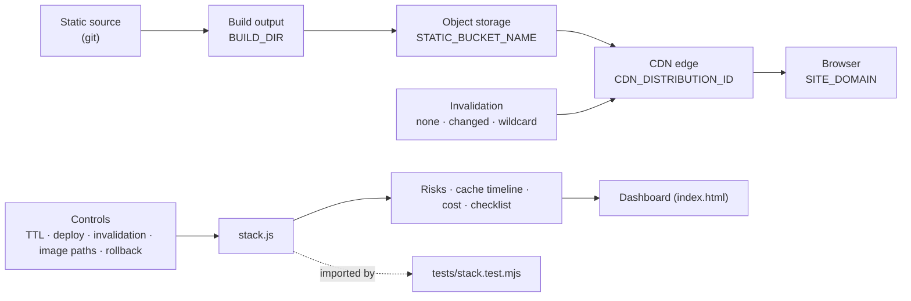
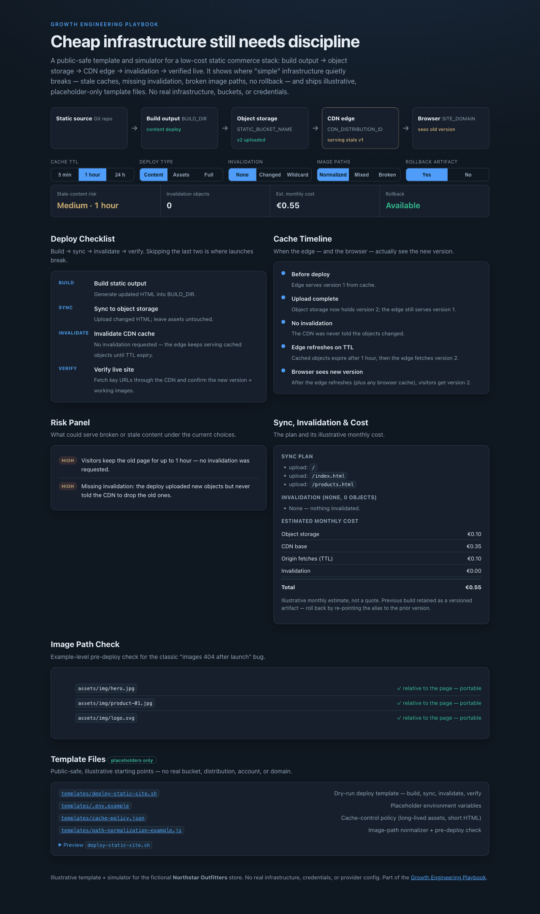

# 08 Static Commerce Stack

A public-safe **template + simulator** for a low-cost static commerce/content
deploy: static build output → object storage → CDN edge cache → invalidation →
verified live site. It makes cache behaviour, deployment risk, and rollback
visible — and ships illustrative, placeholder-only template files. **Not a real
deploy script.**

## Problem

Static hosting is cheap, fast, and reliable — right up until cache boundaries
bite. A content deploy goes out but visitors keep the old page for hours because
nothing invalidated the CDN. Assets change but the HTML that references them is
still cached. Image paths that worked locally 404 behind the CDN. A bad deploy
has no rollback. "Just put it on S3 and a CDN" hides real operational decisions,
and those decisions are where launches break.

## Expertise Signal

Infrastructure judgment for non-huge teams: understanding **where the cache
boundary is**, what invalidation actually costs (in money and blast radius),
why content-hashed assets need different caching than HTML, how image paths
break across a build, and why every deploy needs verification and a rollback
artifact. It explains cheap infrastructure in a way a non-engineer can still
reason about — without pretending it's zero-discipline.

## Business Impact

The value isn't "using object storage + a CDN" — it's not shipping broken or
stale pages at launch. The simulator quantifies the trade-offs:

- **Stale content has a duration.** With no invalidation, visitors keep the old
  version for the **full TTL** (5 min → 1 h → 24 h in the demo). On a 24-hour
  TTL that's a day of wrong prices or missing products.
- **Invalidation is a dial with a cost.** Changed-path invalidation clears a
  handful of objects cheaply; a wildcard clears everything — simple, but it
  refetches the whole site from origin (higher cost, cache-stampede risk). The
  demo shows both the €-cost and the object blast radius.
- **The expensive bugs are cheap to prevent.** Broken image paths, stale HTML
  after an asset deploy, and a missing rollback artifact are all caught in the
  risk panel *before* launch instead of in a customer complaint.

## Architecture

Client-side simulator; no backend and no real infrastructure. The decision
engine is one dependency-free module shared by the UI and the smoke test.



## Quickstart

Serve the folder over HTTP (the template preview is fetched at runtime):

```bash
# from the repository root
python3 -m http.server 8000
# then open http://localhost:8000/08-static-commerce-stack/
```

**Live demo:**
[aaronwest-repo.github.io/growth-engineering-playbook/08-static-commerce-stack](https://aaronwest-repo.github.io/growth-engineering-playbook/08-static-commerce-stack/)

Run the smoke test (also checks the templates are placeholder-only):

```bash
cd 08-static-commerce-stack
node tests/stack.test.mjs
```

## How It Works

1. **Pipeline** — static source → build → object storage → CDN edge → browser
   (plus optional custom domain/DNS), each labelled with a placeholder.
2. **Controls** — cache TTL (5 min / 1 h / 24 h), deploy type (content / assets
   / full), invalidation scope (none / changed / wildcard), image path mode
   (normalized / mixed / broken), and rollback availability.
3. **Simulation** — a deploy checklist, sync plan, cache status, invalidation
   plan, a cache timeline (before → upload → invalidation → edge refresh →
   browser), a stale-content risk level, an illustrative monthly cost, and a
   rollback note.
4. **Risk panel** — flags stale HTML, missing invalidation, stale assets after a
   content deploy, over-broad wildcard invalidation, broken image paths, and a
   missing rollback artifact.
5. **Image path check** — an example-level pre-deploy check that catches the
   classic broken-path bugs (absolute CMS paths, double slashes, localhost URLs).
6. **Template files** — `templates/` holds a dry-run deploy script, a
   `.env.example`, a `cache-policy.json`, and a path-normalization example. They
   use only placeholders (`STATIC_BUCKET_NAME`, `CDN_DISTRIBUTION_ID`,
   `BUILD_DIR`, `SITE_DOMAIN`) and never touch real infrastructure.

## Trade-offs & Scale

- **Simulator + template, not real infrastructure.** No bucket, distribution,
  account, DNS, TLS, or IAM is created or referenced. The deploy script is
  dry-run and only echoes commands.
- **Provider-generalized, not production config.** Object-storage and CDN
  behaviour is modelled conceptually; real setups differ per provider (headers,
  invalidation semantics, edge functions).
- **Cost estimate is illustrative.** A few euro-scale line items to show
  *direction*, not a billing model or quote.
- **Invalidation behaviour is simplified.** No per-path free tiers, propagation
  variance, or partial-failure handling.
- **Path normalization is example-level.** A handful of patterns, not a full
  site crawler or build plugin.
- **Content-hashing is described, not enforced.** The demo models the
  stable-URL case where invalidation matters most; the `cache-policy.json`
  template shows the content-hash mitigation (immutable assets, short HTML).

## Blog Links

Part of the Web Infrastructure cluster on
[aaronwest.de/blog](https://aaronwest.de/blog). Articles pending:

- *Static Websites for E-Commerce*
- *S3, CDN, and Cache Invalidation Explained*
- *Why Your Static Site Still Needs Deployment Discipline*
- *Cheap Infrastructure That Non-Engineers Can Understand*
- *Image Paths, Build Artifacts, and Broken Deploys*

## Screenshot


