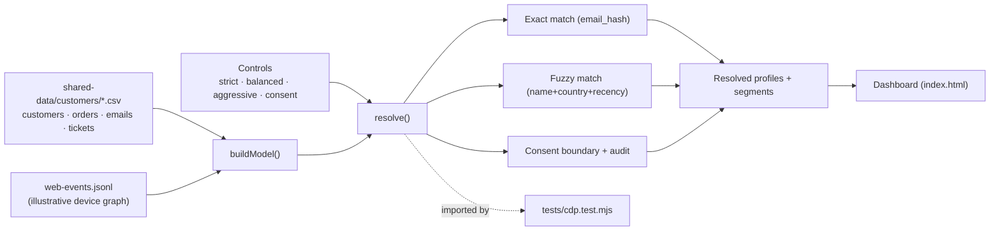
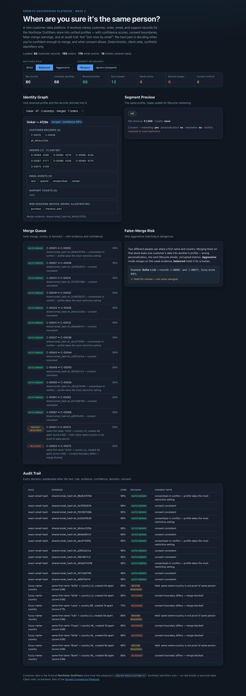

# 09 Mini CDP Identity Resolution

**Wave 2 — Customer Data & Lifecycle Growth.** A small customer-data platform
that resolves messy customer, order, email, and support records into unified
profiles — with confidence scores, merge decisions, consent boundaries,
false-merge warnings, an audit trail, and segment-ready output. Not "join rows
by email."

## Problem

Customer data is only valuable if identity is trustworthy. In reality the same
person shows up as several rows (a second signup, a guest checkout, a different
device), records share an email but disagree on consent, tickets arrive with an
email but no customer ID, and two *different* people share a first name and
country. Merge too eagerly and you leak one customer's data into another's
profile; merge too timidly and you get duplicate journeys and wrong metrics. The
hard part isn't the join — it's deciding **when you're confident enough to
merge, and what consent allows.**

## Expertise Signal

Mature customer-data judgment. Identity resolution here is about **confidence,
consent, false merges, and auditability** — not SQL joins. The demo separates
deterministic matches (shared `email_hash` = same person) from probabilistic
ones (name + country + recency), holds weak matches for human review instead of
auto-merging, blocks merges that cross a consent boundary, resolves conflicting
consent to the **most restrictive** setting, and records every decision so it
can be explained after the fact.

## Business Impact

Bad identity resolution quietly corrupts everything downstream: duplicate
lifecycle journeys, wrong personalization, broken triggers, inflated customer
counts, and privacy risk. On the bundled sample (80 raw records):

- **De-duplication that's honest.** 12 exact-match pairs (same `email_hash`)
  auto-merge with 99% confidence; the resolved profile carries the person's full
  order/email/ticket history instead of splitting it across ghosts.
- **False merges caught, not shipped.** Near-duplicate decoys (same first name +
  country, different hash) are held for review under *balanced* and only merged
  under *aggressive* — the demo shows exactly the merge that would leak one
  Sofia's data into another Sofia's profile.
- **Consent as a first-class boundary.** Merges across a consent boundary are
  blocked; conflicting opt-in/consent resolves to the most restrictive value, so
  a merged profile never becomes *more* marketable than its strictest source.
- **Segment-ready output.** Each trustworthy profile drops straight into VIP,
  churn-risk, new-customer, support-risk, newsletter-eligible, and
  personalization-allowed segments — the input for the rest of Wave 2.

## Architecture

Deterministic, client-side, no backend, synthetic identifiers only. The
resolution engine is one dependency-free module shared by the UI and the test.



## Quickstart

The app reads `../shared-data/`, so serve the **repo root** over HTTP:

```bash
# from the repository root
python3 -m http.server 8000
# then open http://localhost:8000/09-mini-cdp-identity-resolution/
```

Run the smoke test:

```bash
cd 09-mini-cdp-identity-resolution
node tests/cdp.test.mjs
```

## How It Works

1. **Load** — customers, orders, email events, and support tickets, plus web
   events for illustrative device-graph stitching.
2. **Exact match** — records sharing an `email_hash` are the same person and
   auto-merge at 99% confidence.
3. **Fuzzy match** — records with the same normalized first name + country and a
   close signup date get a probabilistic score.
4. **Matching rule** — *strict* only merges on the strong key; *balanced* holds
   fuzzy matches for review; *aggressive* auto-merges them (and shows the false
   merges that creates).
5. **Consent boundary** — with "respect" on, a fuzzy merge across differing
   consent is blocked; exact-match duplicates still merge but resolve consent to
   the most restrictive value and flag the conflict. "Ignore" is a
   comparison-only mode.
6. **Profiles + segments** — each cluster becomes a profile with unified orders,
   emails, tickets, revenue, loyalty, resolved consent, and lifecycle segments.
7. **Audit trail** — every decision records rule, evidence, confidence, decision,
   and a consent note.

## Trade-offs & Scale

- **Deterministic demo, not a production CDP.** No streaming, no warehouse/DB, no
  real-time resolution or survivorship rules beyond most-restrictive consent.
- **Hashed/synthetic identifiers only.** `email_hash` is a token, names are
  fictional; there is no PII to resolve against.
- **Simplified fuzzy matching.** Name + country + signup recency, not a full
  probabilistic record-linkage model (no address/phone/device fingerprint
  weighting, no ML scorer).
- **Consent model is simplified but explicit.** Two flags (marketing,
  personalization) + newsletter opt-in, resolved most-restrictively — real
  systems carry regional rules, purpose limitation, and timestamps.
- **Web-event stitching is illustrative.** There's no real join key between
  anonymous web events and customers, so device-graph links are simulated and
  clearly labelled, not asserted.
- **Aggressive mode is intentionally unsafe** — it exists to demonstrate why
  false merges are dangerous, not as a recommended setting.

## Blog Links

Part of the Customer Data cluster on
[aaronwest.de/blog](https://aaronwest.de/blog). Articles pending:

- *What Is a CDP?*
- *Customer Data You Can Actually Use*
- *Identity Resolution Without Creating a Privacy Problem*
- *Segmentation Starts With Clean Identity*
- *Why Personalization Fails When Customer Data Is Messy*

## Screenshot


