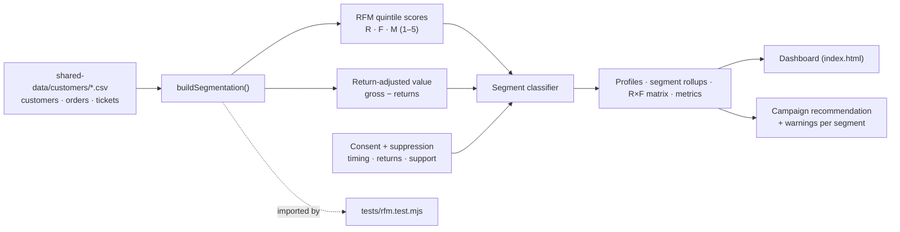
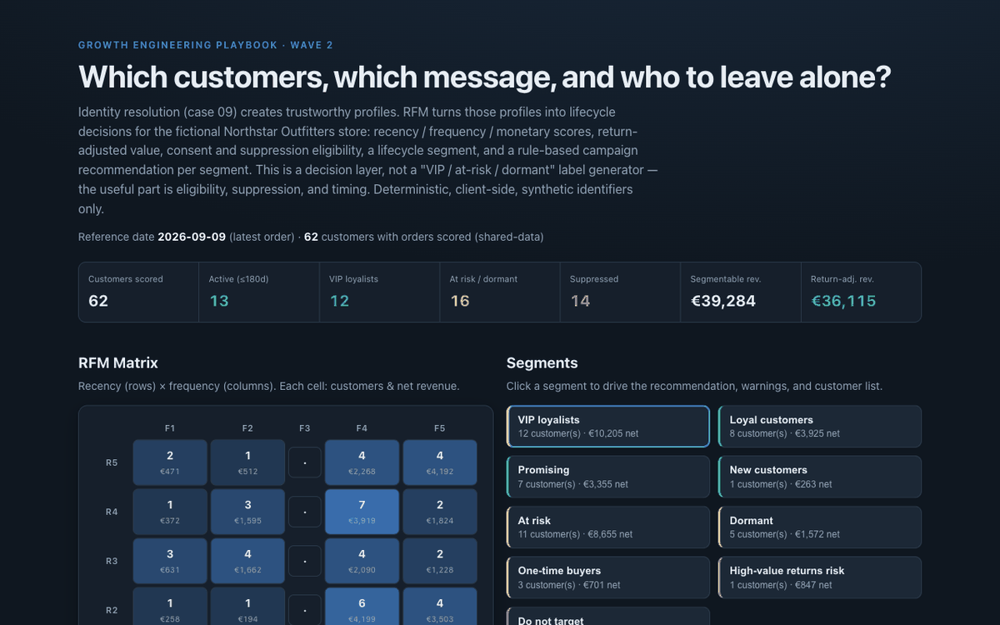

# 10 RFM Segmentation Dashboard

**Wave 2 — Customer Data & Lifecycle Growth.** Identity resolution (case 09)
creates trustworthy profiles. RFM turns those profiles into lifecycle decisions:
recency / frequency / monetary scores, return-adjusted value, consent and
suppression eligibility, a lifecycle segment, and a rule-based campaign
recommendation for each one. Not a "VIP / at-risk / dormant" label generator —
a decision layer.

## Problem

Most "customer segments" are decorative. A dashboard labels someone a *VIP* and
stops there — ignoring that they returned half of what they bought, opted out of
email, bought yesterday (so another promo is just noise), or never consented to
marketing at all. Segments become slides, not decisions. The useful questions
are the ones labels skip: **who is actually eligible, who must be suppressed,
what is this customer worth after returns, and is now even the right time to
contact them?**

## Expertise Signal

Lifecycle judgment, not label-making. This treats segmentation as a decision
system: RFM scores are only the input. On top of them sit **return-adjusted
value** (a customer who returns half their orders is not high value),
**consent + suppression eligibility** (no marketing consent = do not target,
regardless of spend), **timing** (a purchase in the last two weeks suppresses
promo to avoid over-mailing), and **service-before-discount** rules (high
returns and negative support tickets get help, not a coupon). Every placement
comes with the evidence to defend it.

## Business Impact

RFM is valuable because it turns messy order history into **timing and value
decisions** — who to grow, who to win back, who to leave alone. But bad
segmentation is expensive: over-mailing burns list health, blanket discounts
erode margin on people who would have bought anyway, ignoring consent creates
legal risk, and counting returned revenue as "value" produces misleading
lifecycle reporting. On the bundled sample (62 customers with orders):

- **Value measured after returns.** Segmentable revenue (€39.3k) drops to
  €36.1k once returns are removed — and one high-spend customer lands in
  *high-value returns risk*, where the right move is sizing help, not a discount
  that funds the next return.
- **Suppression is first-class.** 14 customers have no marketing consent and are
  routed to *do not target* no matter their RFM score; recent purchasers are
  held from promo; newsletter opt-outs are flagged ineligible for the email
  channel. The dashboard shows *email-eligible now* per segment, not just size.
- **Recommendations, not labels.** Each segment carries a concrete lifecycle
  action and an explicit incentive stance — VIPs get recognition (not margin
  giveaways), at-risk get a margin-aware win-back, dormant get one reactivation
  touch or a holdout.
- **Defensible placement.** Selecting any customer shows the R/F/M evidence,
  latest order, order count, net revenue, and every consent/return/support
  warning behind their segment — the story you can defend to marketing, finance,
  and privacy.

## Architecture

Deterministic, client-side, no backend, synthetic identifiers only. The scoring
and segmentation engine is one dependency-free module shared by the UI and the
test.



## Quickstart

The app reads `../shared-data/`, so serve the **repo root** over HTTP:

```bash
# from the repository root
python3 -m http.server 8060
# then open http://localhost:8060/10-rfm-segmentation-dashboard/
```

**Live demo:**
[aaronwest-repo.github.io/growth-engineering-playbook/10-rfm-segmentation-dashboard](https://aaronwest-repo.github.io/growth-engineering-playbook/10-rfm-segmentation-dashboard/)

Run the smoke test:

```bash
cd 10-rfm-segmentation-dashboard
node tests/rfm.test.mjs
```

## How It Works

1. **Load** — customers, orders, and support tickets. Only customers with at
   least one order are RFM-scored; the reference "today" is the latest date in
   the data, so recency is deterministic.
2. **Score (R/F/M)** — recency, frequency, and return-adjusted monetary value
   are each mapped to a 1–5 quintile score, giving a three-digit RFM code.
3. **Classify** — an ordered rule set assigns one lifecycle segment: VIP
   loyalists, loyal, promising, new, at risk, dormant, one-time, high-value
   returns risk, or do-not-target. Consent gates the last one; returns gate the
   returns-risk one.
4. **Eligibility overlay** — independent of the segment, each customer is checked
   for suppression: no marketing consent, newsletter opt-out, no personalization
   consent, recent-purchase hold, high returns, and recent negative support.
5. **Recommend** — each segment maps to a concrete campaign action and an
   incentive stance (e.g. *at risk → margin-aware win-back*; *high-value returns
   risk → service first, never a discount*).
6. **Explain** — selecting a customer surfaces the full evidence: R/F/M scores,
   days since last order, order count, gross vs returned, net margin, consent
   flags, and warnings — so any placement is defensible.

## Trade-offs & Scale

- **Deterministic dashboard, not a production CDP.** No warehouse, streaming, or
  real-time recompute; the reference date is pinned to the sample's latest order.
- **Simple RFM, not predictive CLV.** Quintile scoring on historical orders — no
  predicted lifetime value, churn probability, or propensity modelling.
- **Small-sample and date-window limits.** With ~62 scored customers, quintile
  bands are coarse and some frequency scores are sparsely populated; recency is
  measured against the data's latest date, not a live clock.
- **Return-adjusted revenue is simplified.** Net value is gross minus returned
  amount; margin subtracts product/shipping cost and discount. It does not model
  restocking cost, partial refunds over time, or exchange vs refund.
- **Consent model is explicit but simplified.** Three flags (marketing,
  personalization, newsletter) resolved into eligibility — real systems add
  regional rules, purpose limitation, and consent timestamps.
- **No real campaign sending.** Recommendations are surfaced, not dispatched;
  there is no ESP, send queue, or measurement loop here.
- **Recommendations are rule-based, not machine learning.** Deliberately legible
  if/then policy, chosen so the reasoning is inspectable rather than opaque.

## Blog Links

Part of the Customer Data & Lifecycle cluster on
[aaronwest.de/blog](https://aaronwest.de/blog). Articles pending:

- *What Is RFM Segmentation?*
- *Customer Segmentation That Actually Changes What You Do*
- *Why Lifecycle Marketing Starts With Customer Data*
- *The Difference Between Segments and Audiences*
- *Why Discounts Are Not a Retention Strategy*

## Screenshot


