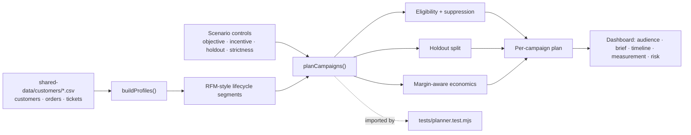
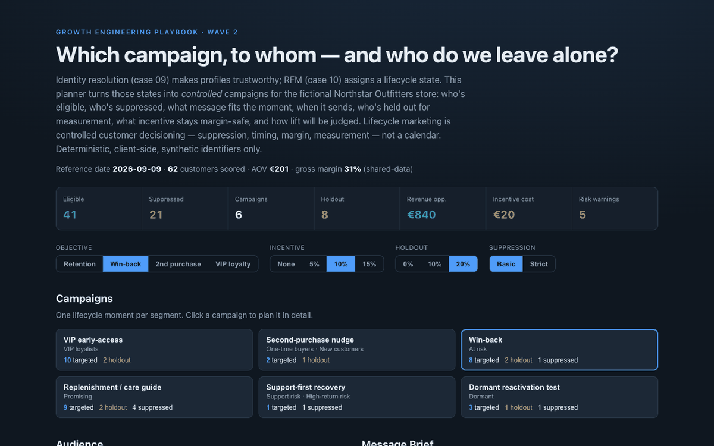

# 11 Lifecycle Campaign Planner

**Wave 2 — Customer Data & Lifecycle Growth.** Identity resolution (case 09)
makes profiles trustworthy. RFM segmentation (case 10) assigns a lifecycle
state. This planner turns those states into *controlled* campaigns — with
eligibility, suppression, holdouts, margin-aware incentives, timing, message
briefs, measurement, and risk controls. Not "send more email."

## Problem

Most lifecycle programs are calendars: a queue of sends, each one going to "as
many people as possible." That quietly does damage. It mails people who never
consented, hits customers who *just* bought (so the next email is noise), throws
a discount at high-return customers (funding the next return), and — worst of
all — measures "success" with no holdout, so nobody can say whether the campaign
actually caused anything. The hard part of lifecycle marketing isn't the send.
It's **deciding who to target, who to suppress, what incentive is margin-safe,
who to hold out, and how you'll know it worked.**

## Expertise Signal

Lifecycle strategy as controlled decisioning, not scheduling. Each campaign is
planned against four levers a real operator actually pulls — **objective,
incentive, holdout, and suppression strictness** — and every plan carries the
things a calendar leaves out: an eligibility and suppression pass (consent,
recent purchase, returns, unresolved support), a **margin-aware incentive**
model that flags over-discounting when the offer eats too much gross margin, a
deliberate **holdout** so lift is measurable, and a per-campaign risk panel. The
signal is judgment about *restraint*: who to leave alone, and why a discount is
often the wrong tool.

## Business Impact

Lifecycle campaigns create value only when three things line up: the audience is
**eligible**, the incentive is **margin-aware**, and the measurement is
**credible**. Miss any one and the program destroys value while looking busy. On
the bundled sample (62 scored customers, AOV €201, 31% gross margin):

- **Suppression is part of the campaign.** Under *basic* rules a handful are
  blocked for consent or returns; under *strict*, recent purchasers, newsletter
  opt-outs, and open negative tickets are added — suppressed customers jump from
  ~21 to ~41. The planner shows exactly who and why, so nobody "accidentally"
  mails them.
- **Margin-aware incentives.** Incentive cost is modelled on redeeming
  converters, and a 15% offer trips an over-discounting warning because it
  consumes ≈48% of gross margin — the tool refuses to let a discount quietly turn
  a campaign net-negative.
- **Holdouts make lift real.** With a 0% holdout every campaign carries a
  measurement warning; adding a 10–20% holdout reduces the targeted audience but
  buys a credible baseline to measure incremental lift against.
- **The right tool per moment.** VIPs get recognition (no discount); at-risk get
  a margin-sized win-back; high-return and support-risk customers get
  service-first recovery with no offer at all; dormant get one reactivation touch
  against a holdout. Each campaign shows its net expected contribution, so spend
  follows value.

## Architecture

Deterministic, client-side, no backend, synthetic identifiers only. Segmentation
and campaign planning are one dependency-free module shared by the UI and the
test.



## Quickstart

The app reads `../shared-data/`, so serve the **repo root** over HTTP:

```bash
# from the repository root
python3 -m http.server 8061
# then open http://localhost:8061/11-lifecycle-campaign-planner/
```

**Live demo:**
[aaronwest-repo.github.io/growth-engineering-playbook/11-lifecycle-campaign-planner](https://aaronwest-repo.github.io/growth-engineering-playbook/11-lifecycle-campaign-planner/)

Run the smoke test:

```bash
cd 11-lifecycle-campaign-planner
node tests/planner.test.mjs
```

## How It Works

1. **Profiles** — customers with orders are scored on recency/frequency/monetary
   and assigned one lifecycle segment (VIP, promising, new, one-time, at-risk,
   dormant, high-return risk, support risk, or do-not-target). AOV and gross
   margin are computed from the order data.
2. **Campaigns** — each segment maps to exactly one lifecycle campaign, so a
   customer sits in a single moment: VIP early-access, second-purchase nudge,
   win-back, replenishment/care, support-first recovery, or dormant reactivation.
3. **Suppression** — a *basic* policy blocks no-consent and high-return
   customers; *strict* adds recent-purchase, newsletter opt-out, and open
   negative-support suppression. Every blocked customer keeps its reason.
4. **Holdout** — a deterministic 0/10/20% slice of the eligible audience is held
   back as the measurement baseline; the rest is the targeted audience.
5. **Economics** — expected converters × AOV gives revenue opportunity; gross
   margin minus incentive cost (charged on converters) gives net expected
   contribution. Incentives only apply to campaigns where a discount fits.
6. **Panels** — the selected campaign shows its audience, message brief
   (subject, preheader, angle, CTA, incentive stance, tone), timeline (send,
   follow-up, measurement window, holdout), measurement maths, and risk controls.

## Trade-offs & Scale

- **Deterministic planner, not a production ESP/CDP.** No warehouse, no segment
  sync, no send infrastructure; the reference date is pinned to the sample's
  latest order.
- **No real sending.** Campaigns are planned and costed, never dispatched — there
  is no ESP, deliverability model, or send queue.
- **Simplified revenue / lift model.** Fixed per-campaign conversion assumptions
  × a single AOV; no predicted CLV, propensity scoring, or per-customer lift.
- **Simplified consent / suppression rules.** A small set of flags and windows —
  real programs layer regional consent, frequency capping, and purpose limits.
- **Holdout logic is illustrative.** A deterministic slice for demonstration, not
  randomised assignment with power analysis or sequential testing.
- **Recommendations are rule-based, not ML.** Deliberately legible if/then
  policy so the reasoning is inspectable rather than opaque.
- **Does not replace creative or legal review.** Message briefs are starting
  points; consent and claims still need human sign-off before any send.

## Blog Links

Part of the Customer Data & Lifecycle cluster on
[aaronwest.de/blog](https://aaronwest.de/blog). Articles pending:

- *Lifecycle Marketing Starts With Customer Data*
- *Why Segments Are Not Campaigns*
- *Holdout Groups for E-Commerce Campaigns*
- *Why Discounts Are Not a Retention Strategy*
- *Suppression Rules Are Part of the Campaign*

## Screenshot


