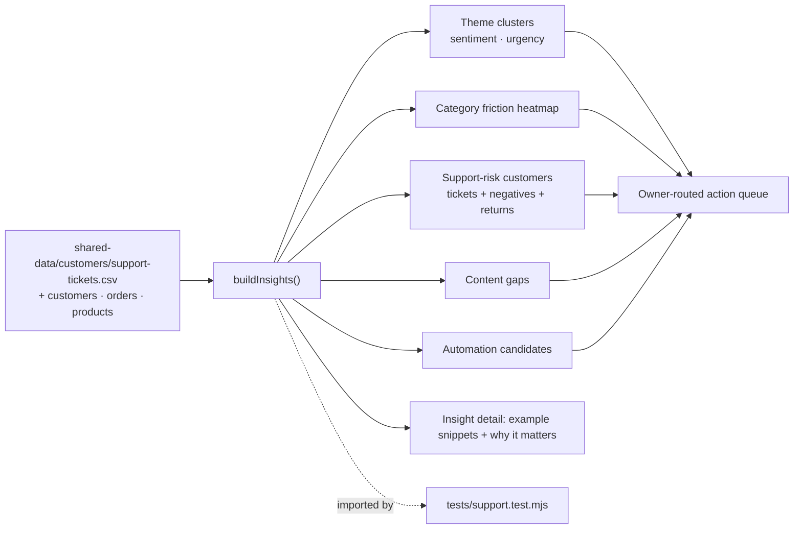
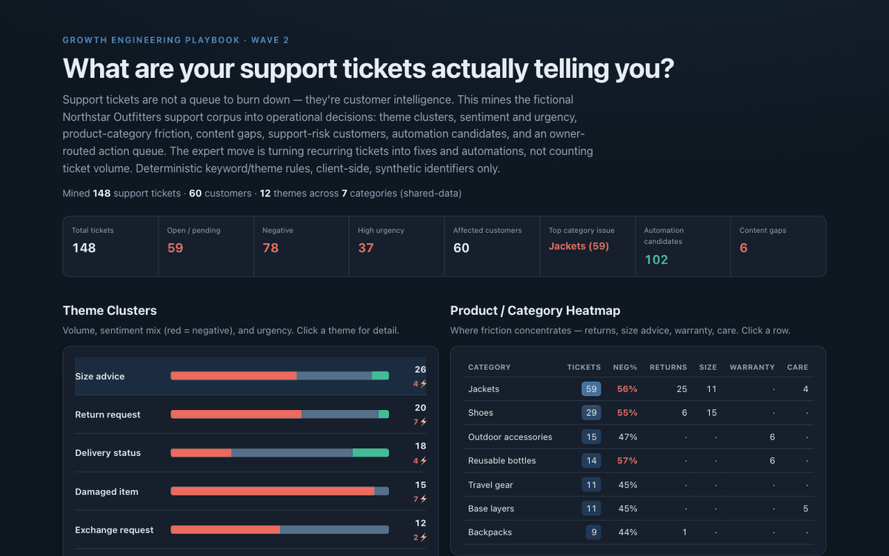

# 12 Customer Support Insight Miner

**Wave 2 — Customer Data & Lifecycle Growth.** Support tickets are not just
problems to close — they are structured customer intelligence. This mines a
support corpus into operational decisions: theme clusters, sentiment/urgency,
product-category friction, content gaps, support-risk customers, automation
candidates, and an owner-routed action queue. Not a ticket-volume dashboard.

## Problem

Most support analytics stops at "how many tickets, how fast did we close them."
That treats each ticket as a one-off and hides the thing that actually matters:
the *patterns*. The same size question keeps arriving for the same category. One
product family drives every warranty claim. "Where is my order?" is a third of
the queue and could answer itself. A handful of customers contact support again
and again while quietly returning half of what they buy. Closed individually,
those tickets look like productivity. Read together, they're a to-do list for
merchandising, content, logistics, and automation — **if you mine them instead
of just counting them.**

## Expertise Signal

Customer support treated as customer data. The demo turns a raw ticket corpus
into decisions a specific owner can act on: it clusters themes with sentiment and
urgency, builds a **product-category friction heatmap** (returns, size advice,
warranty, care), flags **support-risk customers** (repeat contacts + negatives +
returns) with a lifecycle recommendation, derives **content gaps** where a better
page would deflect the contact, identifies **automation candidates** where a
workflow could handle the ticket end-to-end, and routes everything into a
prioritised **action queue** with an owner (ecommerce, merchandising, logistics,
customer service, content/SEO, automation). The expert move is the routing and
the "why it matters," not the ticket count.

## Business Impact

Support tickets are a customer-intelligence source most teams waste. Mining them
reduces repeat contacts, improves product pages, prevents returns, prioritises
product fixes, surfaces risky customers for lifecycle handling, and finds
automation opportunities. Bad support analytics does the opposite — it hides
product friction and turns recurring, fixable issues into an endless stream of
one-off tickets. On the bundled sample (148 tickets, 60 customers):

- **Friction has an address.** The heatmap concentrates returns and size advice
  on **Jackets** and **Shoes** — a merchandising/content fix, not a support one.
  Fixing the size guidance there attacks the returns at the source.
- **Automation is quantified.** "Where is my order?" and self-serve returns are
  the biggest, simplest deflection; the demo counts exactly how many tickets each
  automation candidate would absorb, so the build is justified by volume.
- **Risky customers surface early.** Customers with repeat contacts, negative
  sentiment, and returns are scored and handed a *service-first* lifecycle
  recommendation — resolve before you market, don't send them a promo.
- **Every insight has an owner.** The action queue turns the signals into
  prioritised next actions routed to merchandising, content/SEO, logistics,
  customer service, or automation — so support intelligence leaves the helpdesk.

## Architecture

Deterministic, client-side, no backend, synthetic identifiers only. The mining
engine is one dependency-free module shared by the UI and the test.



## Quickstart

The app reads `../shared-data/`, so serve the **repo root** over HTTP:

```bash
# from the repository root
python3 -m http.server 8062
# then open http://localhost:8062/12-customer-support-insight-miner/
```

**Live demo:**
[aaronwest-repo.github.io/growth-engineering-playbook/12-customer-support-insight-miner](https://aaronwest-repo.github.io/growth-engineering-playbook/12-customer-support-insight-miner/)

Run the smoke test:

```bash
cd 12-customer-support-insight-miner
node tests/support.test.mjs
```

## How It Works

1. **Load** — support tickets plus customers, orders, and the product catalog.
   Each ticket carries a theme, sentiment, urgency, product/category, status, and
   invented subject/message text to mine.
2. **Theme clusters** — tickets group by theme with a sentiment mix and urgency
   profile, sorted by volume, so the loudest recurring issues rise to the top.
3. **Category heatmap** — friction is rolled up per product category with
   negative share and return/size/warranty/care breakdowns, showing *where* a fix
   has the widest effect.
4. **Support-risk customers** — customers are scored on ticket count, negative
   sentiment, and returns (joined from orders), each with a lifecycle
   recommendation (service-first, fit follow-up, or monitor).
5. **Content gaps & automation** — recurring themes above a threshold become
   content-gap fixes (with an owner) or automation candidates (delivery-status
   auto-reply, self-serve returns, size recommender, warranty evidence, urgent
   escalation), each sized by ticket volume.
6. **Action queue** — the signals are turned into prioritised actions routed to a
   specific owner. Selecting any theme, category, or customer shows example
   ticket snippets and the commercial reason it matters.

## Trade-offs & Scale

- **Deterministic text mining, not a production NLP model.** Themes come from the
  labelled corpus; there is no live model reading free text.
- **Simple keyword/theme rules, not embeddings.** Clustering is by explicit theme
  field, not semantic similarity or topic modelling.
- **Sample ticket volume, not warehouse-scale analytics.** ~150 tickets for a
  legible demo — real programs mine tens of thousands with time-series trends.
- **Sentiment is synthetic / rule-based.** Sentiment and urgency are generated
  deterministically per theme, not inferred from language.
- **The action queue is advisory, not a ticketing integration.** It recommends
  owners and actions; it does not create tasks or write back to a helpdesk.
- **No real helpdesk API.** No Zendesk/Gorgias/Freshdesk connection; the corpus is
  static shared-data.
- **No personal data.** Identifiers are synthetic tokens; names, brands, and
  ticket text are invented.

## Blog Links

Part of the Customer Data & Lifecycle cluster on
[aaronwest.de/blog](https://aaronwest.de/blog). Articles pending:

- *Customer Service Is Customer Intelligence*
- *Support Tickets as a Product Data Source*
- *Turning Returns and Complaints Into Better Product Pages*
- *Automation Opportunities Hidden in Support Tickets*
- *Why Support Data Belongs in Lifecycle Marketing*

## Screenshot


