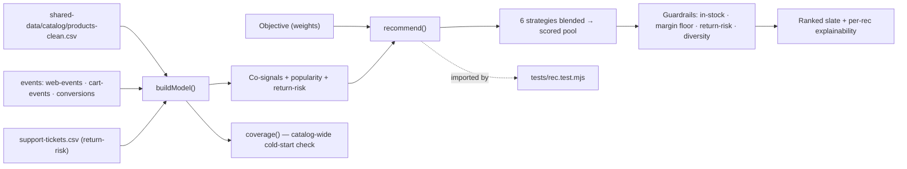
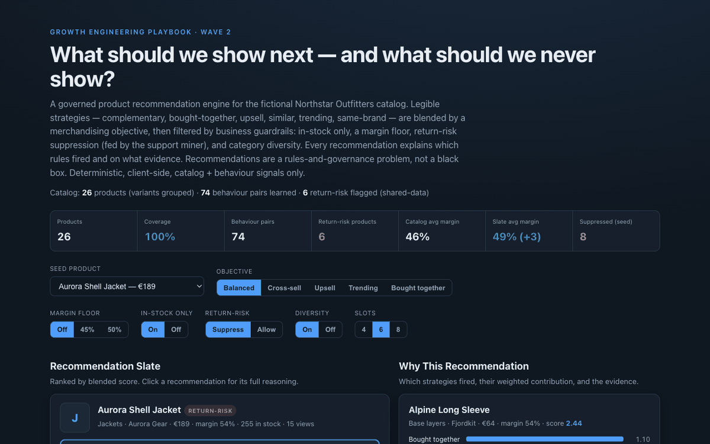

# 13 Recommendation Rules Engine

**Wave 2 — Customer Data & Lifecycle Growth.** Identity resolution builds
trustworthy profiles, RFM assigns lifecycle states, the lifecycle planner turns
segments into campaigns, and the support miner surfaces friction. This turns the
catalog + behaviour signals into **merchandising decisions**: what to show, why,
and — just as important — what *not* to show. A governed rules engine, not a
black-box "customers also bought" widget.

## Problem

Recommendation widgets are easy to bolt on and hard to trust. The default
"customers also bought" box optimises for one signal (co-occurrence) and quietly
ignores the business: it will happily recommend an out-of-stock item, a
low-margin loss-leader, a product your support queue is drowning in returns for,
or five near-identical variants of the same jacket. And when a merchandiser asks
*"why is this here?"*, there's no answer. The hard part of recommendations isn't
finding similar items — it's **governing** them: blending several legible
strategies, enforcing business guardrails, and being able to explain every slot.

## Expertise Signal

Recommendations treated as rules and governance, not a model score. Six legible
strategies — **complementary** (cross-category merchandising rules),
**bought-together** (co-cart behaviour), **upsell** (pricier, at-least-as-
profitable same-category), **similar**, **trending**, and **same-brand** — are
blended by a merchandising **objective**, then passed through business
**guardrails**: in-stock only, a **margin floor**, **return-risk suppression**
(fed by the support-ticket miner from case 12), and **category diversity**. Every
recommendation carries its blended score, the strategies that fired, and the
evidence (co-cart baskets, margin vs seed, price delta, popularity). The signal
is judgment about *restraint and explainability* — the guardrails and the "why,"
not just the similarity.

## Business Impact

A recommendation slate is a merchandising surface, and an ungoverned one leaks
value: it erodes margin with discounts you didn't need to show, recommends items
you can't ship, amplifies products that come straight back as returns, and buries
variety under near-duplicates. On the bundled catalog (26 products after grouping
variants, 74 behaviour pairs learned):

- **Margin-aware by construction.** A margin floor removes low-margin candidates
  (a 50% floor drops ~11 of the pool for a typical jacket seed) and the slate's
  average margin is reported against the catalog average, so you can see the lift.
- **Return-risk suppression, cross-fed from support.** Products with a cluster of
  returns/exchange/damaged tickets are flagged and suppressed by default — the
  recommender refuses to push a jacket the support queue is fighting. Toggle it
  off and the risky item reappears, exactly the merchandising trade-off to weigh.
- **Diversity beats near-duplicates.** Category diversity caps the slate at two
  per category, so a "similar items" objective doesn't return five variants of
  the same product.
- **Every slot is explainable.** Each recommendation shows which strategies fired
  and their weighted contribution — the answer to "why is this here?" that turns a
  black box into a reviewable merchandising decision. Catalog coverage is reported
  so cold-start products are visible, not hidden.

## Architecture

Deterministic, client-side, no backend, catalog + behaviour signals only. The
scoring and governance engine is one dependency-free module shared by the UI and
the test.



## Quickstart

The app reads `../shared-data/`, so serve the **repo root** over HTTP:

```bash
# from the repository root
python3 -m http.server 8063
# then open http://localhost:8063/13-recommendation-rules-engine/
```

**Live demo:**
[aaronwest-repo.github.io/growth-engineering-playbook/13-recommendation-rules-engine](https://aaronwest-repo.github.io/growth-engineering-playbook/13-recommendation-rules-engine/)

Run the smoke test:

```bash
cd 13-recommendation-rules-engine
node tests/rec.test.mjs
```

## How It Works

1. **Group variants** — S/M/L rows collapse into one recommendable product
   (representative = an in-stock variant), so the slate never shows three sizes of
   the same jacket.
2. **Learn signals** — co-cart pairs (from baskets), co-view/co-purchase (by
   visitor), popularity (views + purchases), and return-risk (returns/exchange/
   damaged support tickets per product).
3. **Run strategies** — for a seed product, six strategies each propose scored
   candidates with a human-readable reason and evidence.
4. **Blend by objective** — the objective (balanced, cross-sell, upsell, trending,
   bought-together) weights each strategy; a candidate surfaced by several
   strategies accumulates their contributions plus small margin/popularity boosts.
5. **Apply guardrails** — in-stock only, margin floor, return-risk suppression,
   and category diversity filter the pool, each reporting how many it removed.
6. **Rank + explain** — the top N fill the slate; selecting one shows the weighted
   contribution of each strategy, the reasons, and margin/price/popularity vs the
   seed. Catalog coverage flags any cold-start products.

## Trade-offs & Scale

- **Deterministic rules engine, not an ML recommender.** No matrix factorisation,
  embeddings, or learned ranker — legible if/then strategies by design.
- **Co-signals from a sample, not warehouse-scale logs.** Co-cart is the strongest
  behaviour signal here; co-view/co-purchase are sparse because the sample's
  sessions are single-product. Real systems mine far denser event history.
- **Static blend weights, not learned.** Objective weights are hand-tuned to be
  legible, not fit to conversion data or bandit-optimised.
- **Return-risk is a simple ticket-count threshold.** It demonstrates cross-signal
  governance (support → merchandising); a production version would model return
  rate and cost, not just ticket volume.
- **No personalisation.** Recommendations are product-to-product (seed-based); they
  do not yet fold in the individual customer's RFM/lifecycle state.
- **Advisory, not a storefront integration.** The slate is computed and explained;
  there is no PDP, cart, or A/B serving layer here.

## Blog Links

Part of the Customer Data & Lifecycle cluster on
[aaronwest.de/blog](https://aaronwest.de/blog). Articles pending:

- *Recommendations Are a Governance Problem, Not a Model*
- *Why Your "Customers Also Bought" Widget Loses Money*
- *Margin-Aware Merchandising Rules*
- *Feeding Support Signals Into Recommendations*
- *Explainable Recommendations for Merchandisers*

## Screenshot


