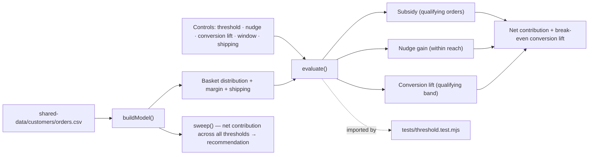
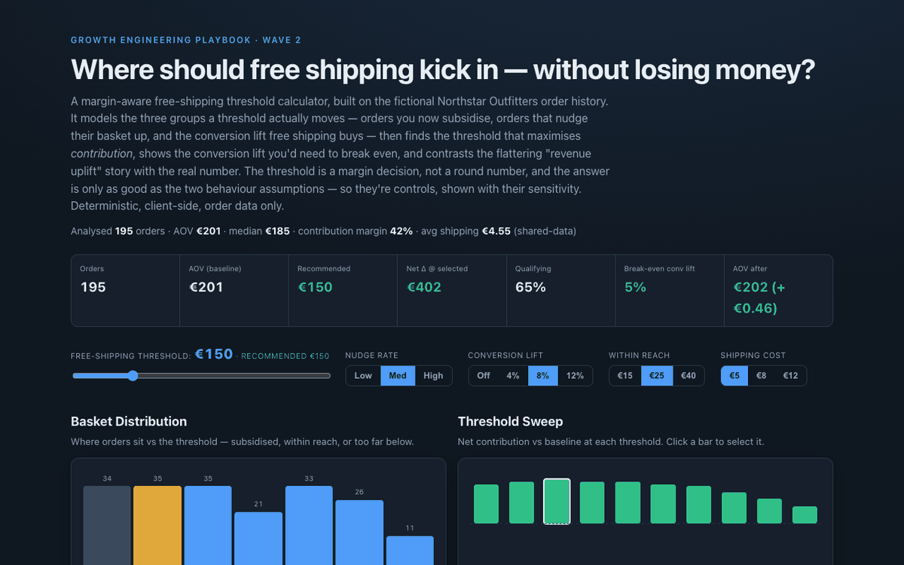

# 14 Free-Shipping Threshold Calculator

**Wave 2 — Customer Data & Lifecycle Growth.** The lifecycle wave built demand:
trustworthy profiles, segments, campaigns, support insight, recommendations.
This is where demand meets margin — the free-shipping threshold, sized from the
store's own basket distribution instead of a round number. The margin-aware
capstone to Wave 2.

## Problem

"Free shipping over €50" is one of the most common e-commerce decisions and one
of the most casually made — a round number, or whatever a competitor shows. But a
threshold quietly moves three different groups of orders in opposite directions:
the ones already above it now ship free at your expense, a few just below it nudge
up, and the offer lifts checkout completion on the qualifying band. Set it wrong
and you either subsidise shipping on orders you'd have won anyway or push a
threshold so high nobody reaches it. The honest answer depends on your **basket
distribution, your margin, and your shipping cost** — not on a round number.

## Expertise Signal

Unit-economics literacy applied to a decision most teams eyeball. The tool models
the threshold as a **contribution-margin** problem with three explicit effects —
**subsidy** (shipping absorbed on already-qualifying orders), **basket nudging**
(within-reach orders topping up, net of the shipping now absorbed), and
**conversion lift** (free shipping recovering abandoned checkouts on the
qualifying band) — then sweeps every candidate threshold to find the one that
maximises net contribution. It reports the **break-even conversion lift** and
contrasts the flattering "revenue uplift" number with the real contribution. And
it refuses false precision: the two behavioural inputs are assumptions, exposed as
controls, and the recommendation visibly moves with them.

## Business Impact

Free shipping is often the single largest voluntary margin give-back a store
makes, and it's usually un-modelled. Getting the threshold right protects margin
without killing the conversion benefit; getting it wrong is invisible because the
"revenue uplift" always looks positive. On the bundled order history (195 orders,
AOV €201, 42% contribution margin, ~€4.55 shipping):

- **A real optimum, not a round number.** At €5 shipping and an 8% conversion
  lift the sweep peaks around **€150 net-positive**, with both lower and higher
  thresholds worse — a curve you can point at, not a guess.
- **The vanity number, exposed.** The naive "revenue uplift" can read **10×+**
  the real net contribution because it counts driven revenue while ignoring the
  subsidy and cost of goods. Same policy, two very different stories.
- **Nudging close-to-threshold customers loses money.** The per-nudger average
  goes negative when the top-up is small — the added margin can't cover the
  shipping you now absorb. A subtle trap the tool makes explicit.
- **It knows when to say no.** Raise shipping cost to €12 and every threshold
  turns net-negative; the tool says so and shows the conversion lift you'd need to
  justify the policy — the commercially honest answer, not a forced recommendation.

## Architecture

Deterministic, client-side, no backend, order data only. The model is one
dependency-free module shared by the UI and the test.



## Quickstart

The app reads `../shared-data/`, so serve the **repo root** over HTTP:

```bash
# from the repository root
python3 -m http.server 8064
# then open http://localhost:8064/14-free-shipping-threshold-calculator/
```

**Live demo:**
[aaronwest-repo.github.io/growth-engineering-playbook/14-free-shipping-threshold-calculator](https://aaronwest-repo.github.io/growth-engineering-playbook/14-free-shipping-threshold-calculator/)

Run the smoke test:

```bash
cd 14-free-shipping-threshold-calculator
node tests/threshold.test.mjs
```

## How It Works

1. **Model the store** — from the order history: basket-value distribution
   (histogram), AOV, blended contribution margin, and average shipping cost.
2. **Split every order** — at a candidate threshold: *above* (qualifies, ships
   free), *within reach* (a window below, may nudge up), or *far below*
   (unaffected).
3. **Net the three effects** — subsidy (shipping × qualifying orders), nudge gain
   (top-up margin − absorbed shipping, at the nudge rate), and conversion lift
   (recovered orders on the qualifying band, net of shipping and COGS).
4. **Sweep + recommend** — evaluate every candidate threshold and recommend the
   one with the highest net contribution; the sweep chart shows the trade-off.
5. **Stress the assumptions** — nudge rate, conversion lift, within-reach window,
   and shipping cost are controls; the tool reports the **break-even conversion
   lift** and flags when a threshold quietly loses money.
6. **Wrong vs right** — the naive revenue-uplift number sits next to the real net
   contribution, so the gap between the flattering story and the margin truth is
   unmissable.

## Trade-offs & Scale

- **Deterministic model, not a live pricing experiment.** It sizes the decision
  from history; it doesn't run the A/B test that would confirm the response.
- **Two behavioural assumptions.** Nudge rate and conversion lift are inputs, not
  measured — surfaced as controls with a break-even readout, not hidden in a
  formula. The recommendation is only as good as those inputs.
- **Single global threshold.** No free-shipping-by-segment, by-region, or
  by-margin-tier; no time-limited promotions.
- **Simplified demand response.** Conversion lift is modelled as a flat uplift on
  the qualifying band; it ignores cross-price effects, returns-behaviour shifts,
  and competitor response.
- **Sample-scale distribution.** ~200 orders for a legible demo; a real analysis
  would use a full order history and segment the basket curve.
- **Shipping cost is a flat per-order input.** No carrier-zone or weight-based
  shipping model.

## Blog Links

Part of the Growth Economics / Foundations cluster on
[aaronwest.de/blog](https://aaronwest.de/blog). Articles pending:

- *The Free-Shipping Threshold*
- *The Number Most Teams Calculate Wrong*
- *Contribution Margin, Not Revenue*
- *Basket Psychology and Thresholds*
- *When Free Shipping Costs You Money*

## Screenshot


