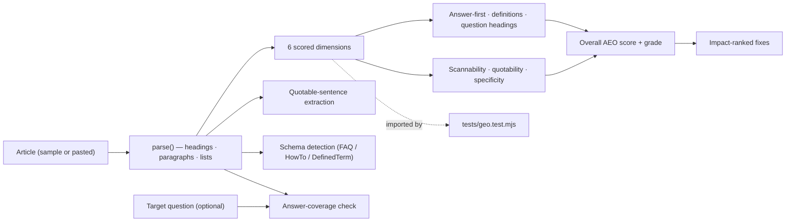
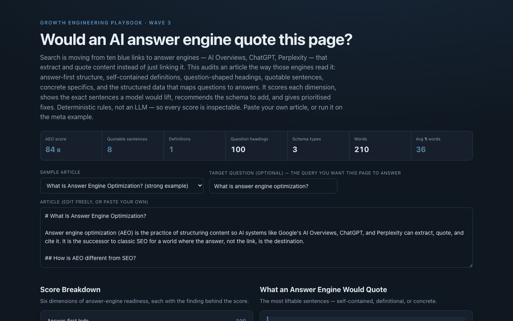

# 15 GEO / AEO Content Checker

**Wave 3 — Content & SEO for the AI era.** Search is shifting from ten blue links
to answer engines — Google's AI Overviews, ChatGPT, Perplexity — that *extract
and quote* content instead of just linking it. This audits an article the way
those engines read it and scores how quotable, extractable, and citable it is.
Deterministic rules, not an LLM, so every score is inspectable.

## Problem

Most "SEO checkers" still grade for a world of keywords and backlinks. But when
the answer, not the link, is the destination, a different property decides whether
you show up: **extractability**. Can a machine lift a clean, self-contained answer
from your page — a definition, a direct response under a question-shaped heading, a
concrete sentence that stands on its own — without the surrounding page? A wall of
throat-clearing prose can rank fine in classic SEO and still be invisible to an
answer engine because there's nothing quotable in it. Teams optimising for the old
signals are quietly losing the new surface.

## Expertise Signal

Treats answer-engine optimisation as a **structure-and-extractability** problem,
not keyword density. The checker reads an article the way a model does and scores
six dimensions — **answer-first lede, extractable definitions, question-shaped
headings, scannability, quotable statements, and specificity** — then does the
things a generic readability tool won't: it surfaces the **exact sentences an
answer engine would quote**, recommends the **structured data** to add (FAQPage /
HowTo / DefinedTerm, detected from the content), checks **answer coverage** for a
target question, and returns **impact-ranked fixes**. Because it's rule-based, not
an LLM, every score traces to a concrete, defensible reason.

## Business Impact

Being the *quoted* answer is the new front page. Content that AI systems can
extract earns citations, brand mentions, and referral traffic in AI surfaces;
content they can't parse is skipped even when it ranks. Mining a page for
extractability shows exactly why it will or won't be quoted, and what to change.
On the bundled samples the audit discriminates sharply:

- **It separates quotable from unquotable content.** A well-structured explainer
  scores in the 80s (grade B) with 8 quotable sentences; a same-length wall of
  text scores in the 30s (grade F) with **zero** liftable sentences — the exact
  gap answer engines act on.
- **It shows what a model would lift.** The tool extracts the specific sentences —
  definitions, concrete facts, standalone statements — an engine is most likely to
  quote, so you can see (and improve) your own citations.
- **It turns content into structured data.** It detects FAQ and HowTo patterns and
  emits ready JSON-LD, closing the gap between prose and the schema answer engines
  rely on to map questions to answers.
- **It answers "will this rank for my question?"** Give it a target question and it
  tells you whether the page answers it early and quotably, or buries the answer
  where no engine will find it.

## Architecture

Deterministic, client-side, no backend, no LLM. Sample articles are bundled; you
can paste your own. The analyzer is one dependency-free module shared by the UI and
the test.



## Quickstart

No shared-data needed — sample articles are bundled. Open it any way you like:

```bash
# from the repository root
python3 -m http.server 8065
# then open http://localhost:8065/15-geo-content-checker/
```

**Live demo:**
[aaronwest-repo.github.io/growth-engineering-playbook/15-geo-content-checker](https://aaronwest-repo.github.io/growth-engineering-playbook/15-geo-content-checker/)

Run the smoke test:

```bash
cd 15-geo-content-checker
node tests/geo.test.mjs
```

## How It Works

1. **Parse** — the article is split into a title, headings, paragraphs, and lists.
2. **Score six dimensions** — answer-first lede (is the answer up top?),
   extractable definitions ("X is …"), question-shaped headings, scannability
   (paragraph length, lists, heading density), quotable statements (self-contained,
   8–32 words, no dangling references), and specificity (concrete facts/numbers).
3. **Blend into an overall score + grade** — weighted toward the dimensions answer
   engines reward most (answer-first, quotability, definitions).
4. **Extract what a model would quote** — the most liftable sentences, tagged as
   definition, concrete, or standalone.
5. **Recommend structured data** — detect FAQ and HowTo patterns and emit ready
   JSON-LD (Article always; FAQPage / HowTo / DefinedTerm as detected).
6. **Check answer coverage + rank fixes** — for a target question, verify the page
   answers it early and quotably; and return the highest-impact edits first.

## Trade-offs & Scale

- **Deterministic rules, not an LLM.** The point is inspectability — every score
  traces to a rule. It approximates how engines extract; it doesn't call one.
- **English-oriented heuristics.** Definition, question, and quotability patterns
  are tuned for English; other languages would need their own rules.
- **Markdown-ish parsing.** It reads headings/paragraphs/lists from plain text or
  markdown, not rendered HTML/DOM or JavaScript-injected content.
- **On-page signals only.** No crawl, links, Core Web Vitals, or off-page
  authority — that's the job of the technical-SEO auditor later in this wave.
- **Schema is recommended, not validated against Google's live rules.** It emits
  correct-shape JSON-LD; a production step would validate with the Rich Results
  test.
- **Heuristic weights.** The dimension weights are a defensible default, not fit to
  measured AI-citation outcomes.

## Blog Links

Part of the GEO/AEO cluster on
[aaronwest.de/blog](https://aaronwest.de/blog). Articles pending:

- *What Is Answer Engine Optimization?*
- *Writing Content AI Can Actually Quote*
- *Structured Data for Answer Engines*
- *Answer-First: Structuring Pages for AI Overviews*
- *GEO vs SEO: What Actually Changes*

## Screenshot


