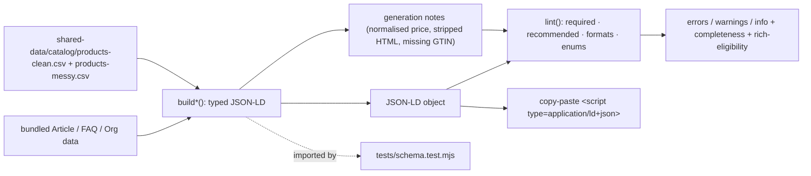
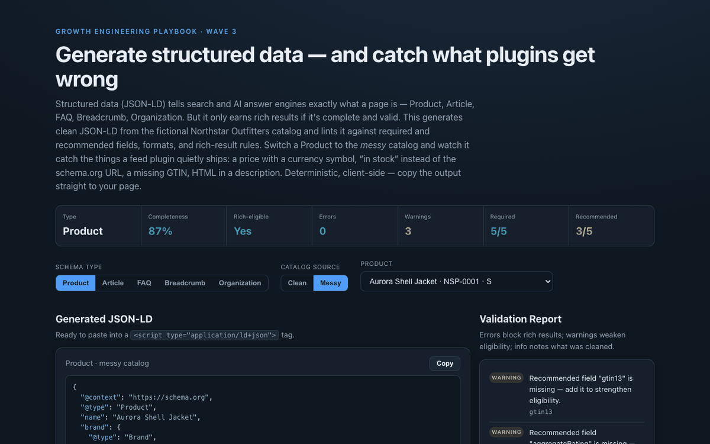

# 16 Schema Markup Generator

**Wave 3 — Content & SEO for the AI era.** The AEO checker (case 15) grades the
prose; this handles the machine-readability layer underneath it. It generates
clean JSON-LD structured data — Product, Article, FAQPage, BreadcrumbList,
Organization — from real catalog data, and **lints it** against the required and
recommended fields, formats, and rich-result rules that decide whether search and
AI answer engines actually use it.

## Problem

Structured data is how a page tells a machine exactly what it is — and it's where
most stores quietly fail. Feed plugins and CMS templates emit JSON-LD that *looks*
present but isn't valid: a price with a currency symbol (`€179,00`) instead of a
number, `"in stock"` instead of the `https://schema.org/InStock` enum Google
checks, a missing GTIN, HTML tags left inside a description, a date in the wrong
format. Each of those quietly disqualifies the page from the rich result it was
supposed to earn — and there's no error message, just absence. The hard part
isn't *adding* schema; it's knowing the difference between markup that validates
and markup that gets ignored.

## Expertise Signal

Treats structured data as a correctness problem with specific, checkable rules —
not a plugin you switch on and forget. The tool generates schema for five types
and, for each, knows the **required vs recommended fields**, the **formats**
(numeric price, ISO date, absolute URL, schema.org enums), and the **common
mistakes**. Point it at the deliberately *messy* catalog and it does what a naive
generator won't: normalises a malformed price and *tells you it was malformed*,
maps `"in stock"` to the schema.org URL, strips HTML from descriptions, and flags
the missing GTIN — each with a severity (error blocks the rich result, warning
weakens it, info notes what was cleaned) and a completeness score. Every finding
traces to a rule, so the output is defensible, not a black-box "SEO score".

## Business Impact

Rich results and AI citations are earned by valid structured data and lost to
invalid markup — silently. Getting it right lifts click-through with richer SERP
listings, makes products eligible for merchant experiences, and gives answer
engines a clean, typed description of the page. On the bundled catalog the
contrast is the lesson:

- **Clean data → eligible markup.** A clean product generates rich-result-eligible
  Product JSON-LD at ~93% completeness, with only the genuinely optional
  `aggregateRating` flagged.
- **Messy data → the mistakes made visible.** The same product from the messy
  catalog surfaces exactly what a feed plugin would ship blind: a price
  (`€179,00`) normalised with a warning, a missing GTIN, HTML stripped from the
  description — so you fix it at the source instead of shipping broken markup.
- **Rich-result eligibility, explained.** Every type shows whether it meets the
  minimum required fields and *why* it does or doesn't — no guessing why Google
  ignored your snippet.
- **Copy-paste output.** The generated JSON-LD is ready to drop into a
  `<script type="application/ld+json">` tag — a usable deliverable, not just a
  score.

## Architecture

Deterministic, client-side, no backend. Product/Breadcrumb schema is built from the
shared catalog; the other types from bundled/derived sample data. The generator and
validator are one dependency-free module shared by the UI and the test.



## Quickstart

The Product/Breadcrumb types read the shared catalog, so serve the **repo root**:

```bash
# from the repository root
python3 -m http.server 8066
# then open http://localhost:8066/16-schema-markup-generator/
```

**Live demo:**
[aaronwest-repo.github.io/growth-engineering-playbook/16-schema-markup-generator](https://aaronwest-repo.github.io/growth-engineering-playbook/16-schema-markup-generator/)

Run the smoke test:

```bash
cd 16-schema-markup-generator
node tests/schema.test.mjs
```

## How It Works

1. **Pick a type** — Product, Article, FAQPage, BreadcrumbList, or Organization.
   Product and Breadcrumb build from a selected catalog product (clean or messy).
2. **Generate** — a typed JSON-LD object is assembled, normalising what it safely
   can: parsing a messy price to a number, mapping availability to the schema.org
   enum, stripping HTML, and recording a note for anything it had to fix or omit.
3. **Lint** — the object is checked for required fields (missing = error),
   recommended fields (missing = warning), and formats (price numeric, currency
   ISO, date ISO-8601, availability enum, absolute URLs).
4. **Score + judge eligibility** — a completeness score (required weighted 2×) and
   a rich-result eligibility verdict with the reason.
5. **Report + copy** — errors, warnings, and info notes are listed with the field
   they touch; the field-coverage checklist shows what's present; and the JSON-LD
   is ready to copy into the page.

## Trade-offs & Scale

- **Approximates the rules, isn't Google.** It encodes the required/recommended
  fields and common formats; validate against the live Rich Results Test and
  Schema.org validator before shipping.
- **A curated set of types.** Five high-value types, not the full schema.org
  vocabulary; no nested Review/Offer aggregates beyond the basics.
- **Sample-scale data.** Product schema is built from the demo catalog; a
  production version would generate across the full feed with per-SKU offers.
- **Bundled inputs for non-catalog types.** Article/FAQ/Organization use sample
  data to demonstrate the shape; wire them to your CMS fields in practice.
- **Normalisation is conservative.** It fixes clearly-malformed prices and
  availability and flags them; it won't invent missing GTINs, images, or ratings.
- **No crawling or injection.** It generates and validates markup; it doesn't
  fetch your live pages or verify the tag is actually on them.

## Blog Links

Part of the GEO/AEO + technical-SEO cluster on
[aaronwest.de/blog](https://aaronwest.de/blog). Articles pending:

- *Structured Data That Actually Earns Rich Results*
- *Why Your Product Schema Gets Ignored*
- *JSON-LD for E-Commerce, Field by Field*
- *Schema for Answer Engines*
- *The Structured-Data Mistakes Plugins Make*

## Screenshot


