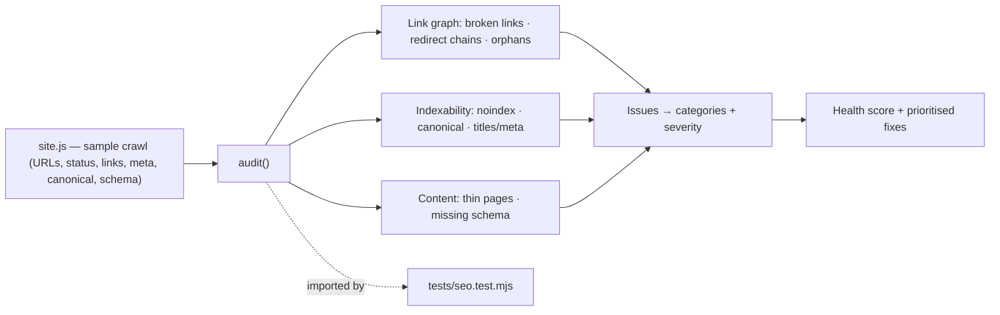
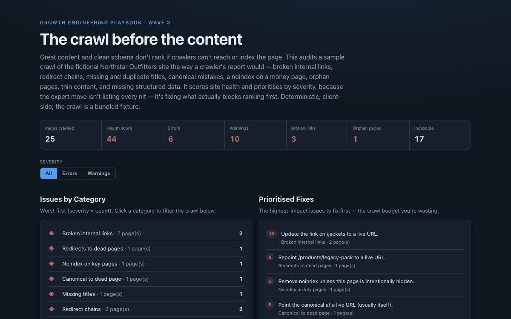

# 17 Technical SEO Auditor

**Wave 3 — Content & SEO for the AI era.** The AEO checker (15) grades the prose
and the schema generator (16) the structured data; this audits the plumbing
underneath both — crawlability and indexability. It runs a crawl-style report over
a sample site and scores its technical-SEO health, prioritised by what actually
blocks ranking.

## Problem

The best content in the world doesn't rank if a crawler can't reach it, or if the
page quietly tells search engines not to index it. These failures are invisible in
a CMS: a link to a page that 404s, a redirect chain that leaks crawl budget, a
`noindex` left on a product page, a canonical pointing at a dead URL, a page with
zero internal links that no crawler ever finds, two products sharing one title.
None of them throw an error — the traffic just never arrives. And most "SEO
audits" bury the three issues that matter under fifty that don't. The hard part is
**triage**: knowing which technical problems are ranking-blocking and fixing those
first.

## Expertise Signal

Technical SEO treated as crawlability + indexability, prioritised by severity —
not a 200-row checklist. The auditor walks a crawl and detects the issues that
actually cost rankings: **broken internal links**, **redirect chains** and
**redirects to dead pages**, **missing/duplicate titles**, **missing meta**,
**canonical mistakes** (missing, or pointing at a 404/redirect), **`noindex` on
money pages**, **orphan pages**, **thin content**, and **missing structured
data** — each classed error / warning / notice. It rolls issues up by category,
scores site health, and produces an impact-ranked fix list, so the output reads
like an operator's to-do list, not a data dump. Every finding names the URL and
the fix.

## Business Impact

Technical debt in the crawl silently caps everything upstream of it: pages that
can't be indexed can't rank, crawl budget wasted on redirect chains isn't spent on
new products, and a `noindex` on a category page removes it from search entirely —
with no alert. Catching these is often the highest-ROI SEO work because the content
already exists; it just can't be found. On the bundled 25-page crawl:

- **Health scored, issues triaged.** The sample site scores 44/100 with 6 errors
  and 10 warnings across 13 categories — and the report leads with the errors
  (broken links, a redirect to a dead page, a noindexed product) before the nits.
- **Ranking-blockers surfaced by name.** A product page left on `noindex`, a
  canonical pointing at a 404 (the page de-indexing itself), and an orphan blog
  post with zero inbound links — each the kind of issue that costs traffic with no
  visible symptom.
- **Crawl budget protected.** Redirect chains and links-to-redirects are flagged
  with the direct destination, so internal links point at final URLs.
- **A prioritised fix list.** Issues roll up by category and sort by impact
  (severity × affected pages), turning a crawl into the order you'd actually work
  the backlog.

## Architecture

Deterministic, client-side, no backend. The crawl is a bundled fixture (a small
site with deliberately injected issues). The auditor is one dependency-free module
shared by the UI and the test.



## Quickstart

No shared-data needed — the crawl is bundled. Serve and open:

```bash
# from the repository root
python3 -m http.server 8067
# then open http://localhost:8067/17-seo-tech-auditor/
```

**Live demo:**
[aaronwest-repo.github.io/growth-engineering-playbook/17-seo-tech-auditor](https://aaronwest-repo.github.io/growth-engineering-playbook/17-seo-tech-auditor/)

Run the smoke test:

```bash
cd 17-seo-tech-auditor
node tests/seo.test.mjs
```

## How It Works

1. **Crawl** — each page carries its status, type, title/meta/canonical/H1, word
   count, `noindex`, structured-data types, and outbound links.
2. **Build the link graph** — inbound link counts per URL, redirect chains
   followed to their final destination, and broken targets identified.
3. **Run the checks** — link health (broken links, redirect chains, dead
   redirects), indexability (noindex on key pages, canonical validity, titles and
   meta), and content (thin pages, missing Product schema, orphans).
4. **Classify + score** — each issue is an error, warning, or notice; a health
   score is derived from the weighted penalty.
5. **Roll up + prioritise** — issues group by category, sorted by impact
   (severity × affected pages); the fix list leads with what to do first.
6. **Explore** — filter the crawl by severity or category, and open any URL to see
   its metadata and every issue found on it with the fix.

## Trade-offs & Scale

- **Audits a bundled crawl, doesn't fetch.** It analyses a sample crawl fixture;
  a production version would ingest a real crawler's export (Screaming Frog,
  Sitebulb) or crawl live.
- **Approximates the rules.** It encodes high-value technical checks, not the full
  surface (hreflang, pagination, Core Web Vitals, log-file crawl stats, XML
  sitemap diffing).
- **Static severity model.** Severity and the health-score weights are a
  defensible default, not calibrated to a specific site's traffic value.
- **On-page + link-graph only.** No rendering, JavaScript execution, robots.txt /
  sitemap parsing, or server-log analysis.
- **Sample scale.** ~25 URLs for a legible demo; real sites need incremental
  crawling and diffing across runs.
- **Complements, doesn't replace, the content and schema tools.** It checks that a
  page can be found and indexed; cases 15 and 16 check that it's worth quoting.

## Blog Links

Part of the technical-SEO + GEO/AEO cluster on
[aaronwest.de/blog](https://aaronwest.de/blog). Articles pending:

- *The Crawl Before the Content*
- *Site Architecture and URL Structure That Doesn't Fight Your SEO*
- *Redirects, Canonicals and Crawl Budget*
- *Orphan Pages and Internal Linking*
- *The Technical SEO Issues That Actually Block Ranking*

## Screenshot


