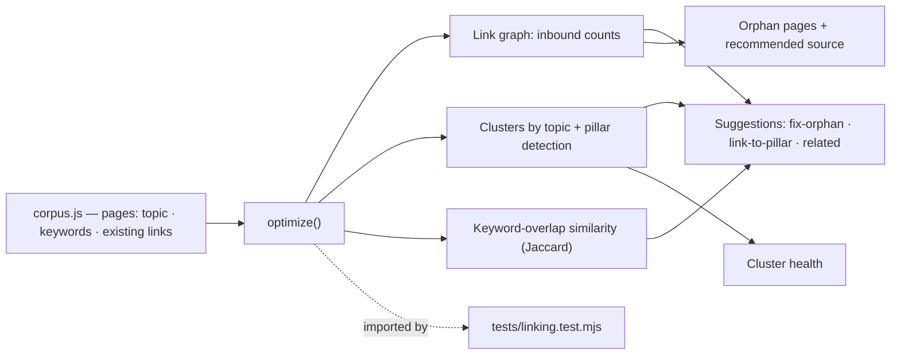
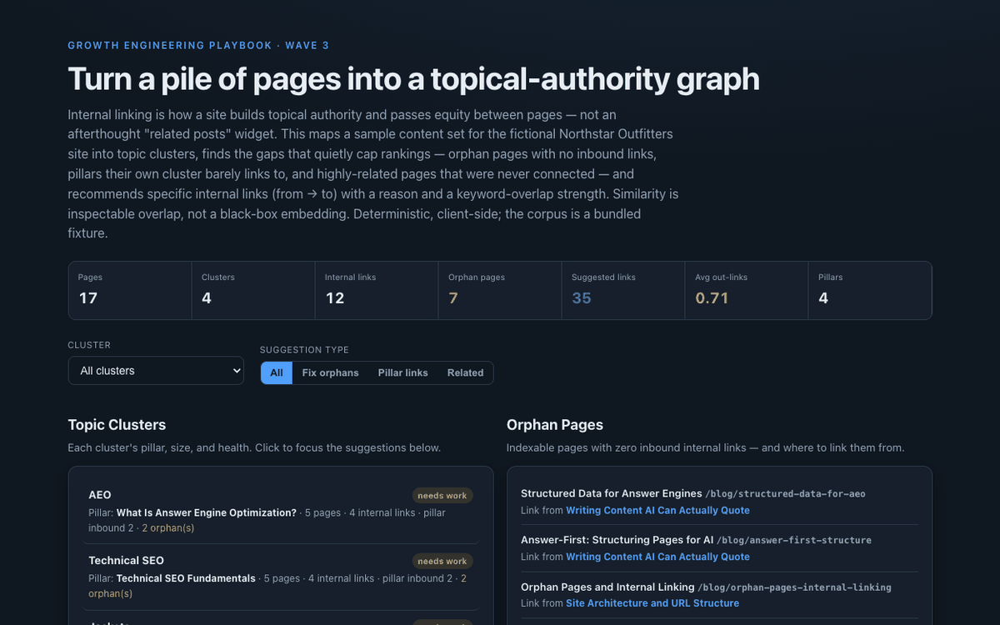

# 18 Internal Linking Optimizer

**Wave 3 — Content & SEO for the AI era.** The AEO checker (15) grades a page, the
schema generator (16) marks it up, and the technical auditor (17) makes sure it's
crawlable. This works the layer that ties pages together: internal linking as
topical-authority engineering — clustering content by topic and recommending the
specific links that build authority and rescue orphaned pages.

## Problem

Internal linking is treated as an afterthought — a "related posts" widget, or
whatever links an author happened to remember. That quietly caps rankings. Pages
end up **orphaned** (no inbound links, so crawlers barely find them and they pass
no authority), **pillar pages** their own cluster forgets to link to, and
**highly-related pages** that were never connected — so a topic never consolidates
into the authority signal search and answer engines reward. The hard part isn't
adding links; it's knowing *which* links, between which pages, and why — turning a
pile of pages into a deliberate topic graph.

## Expertise Signal

Treats internal linking as graph engineering, not decoration. The optimizer builds
the link graph, **clusters pages by topic**, identifies each cluster's **pillar**,
and finds the gaps that matter: **orphans**, **under-linked pillars**, and
**related-but-unlinked** pages. It then recommends specific links (from → to) with
a **reason** (fix-orphan, link-to-pillar, related-content) and a **strength** from
keyword overlap (Jaccard) — deliberately inspectable, not a black-box embedding
score — plus per-cluster health and a per-page to-do. The signal is judgment about
*site structure*: consolidate topics, give every cluster a well-linked hub, and
make sure nothing is stranded.

## Business Impact

Internal links are the highest-leverage on-site SEO lever you fully control — no
outreach, no new content, just connecting what you already have. Fixing the graph
lifts rankings for whole clusters at once, gets orphaned pages indexed and passing
equity, and strengthens the topical-authority signal that both classic search and
answer engines use. On the bundled 17-page corpus:

- **Orphans found and rescued.** 7 pages have zero inbound internal links — each
  gets a recommended source page to link from, so nothing is stranded.
- **Weak clusters exposed.** All four topic clusters are flagged "needs work"
  because their pillars are under-linked or they contain orphans — the structural
  debt a content calendar never surfaces.
- **35 specific, reasoned links.** Not "add more links" but *this page → that
  page, because they share these terms* — an editable to-do list, ranked by
  priority then overlap strength.
- **Cross-cluster relationships caught.** Pages that belong to two topics (a
  structured-data article that's both AEO and technical SEO) are surfaced so the
  graph reflects how content actually relates.

## Architecture

Deterministic, client-side, no backend. The content corpus is a bundled fixture.
The optimizer is one dependency-free module shared by the UI and the test.



## Quickstart

No shared-data needed — the corpus is bundled. Serve and open:

```bash
# from the repository root
python3 -m http.server 8068
# then open http://localhost:8068/18-internal-linking-optimizer/
```

**Live demo:**
[aaronwest-repo.github.io/growth-engineering-playbook/18-internal-linking-optimizer](https://aaronwest-repo.github.io/growth-engineering-playbook/18-internal-linking-optimizer/)

Run the smoke test:

```bash
cd 18-internal-linking-optimizer
node tests/linking.test.mjs
```

## How It Works

1. **Build the graph** — count inbound internal links per page from the corpus's
   existing links.
2. **Cluster by topic** — group pages by topic and pick each cluster's pillar
   (flagged, or the best-linked page), then score cluster health from pillar
   inbound links and orphan count.
3. **Score similarity** — keyword-overlap (Jaccard) between every pair of pages,
   with the shared terms kept for the explanation.
4. **Recommend links** — for each unlinked pair, emit a suggestion when it fixes an
   orphan, connects a page to its pillar, or joins two strongly-related pages —
   with a reason, priority, and strength.
5. **Prioritise + de-dupe** — rank by priority then strength; collapse reciprocal
   related-content pairs so you don't get A→B and B→A for the same relationship.
6. **Explore** — filter by cluster or suggestion type, review orphans with a
   recommended source, and open any page to see its links and the links to add.

## Trade-offs & Scale

- **Keyword-overlap similarity, not embeddings.** Chosen for inspectability — every
  suggestion shows the shared terms. A production version could add semantic
  vectors, but would trade away the "why".
- **Topics are given, not inferred.** The corpus carries a topic per page; a larger
  build would cluster automatically from content and assign topics.
- **Bundled fixture, sample scale.** ~17 pages for a legible demo; real sites feed
  a crawl/CMS export of hundreds to thousands of URLs.
- **No authority weighting.** It counts inbound links, not PageRank-style flow or
  link position/prominence on the page.
- **Suggests, doesn't place.** It recommends links; adding them (and the anchor
  text) is still an editorial step.
- **Anchor text isn't generated.** It picks the pairs; the shared terms hint at
  anchors but don't write them.

## Blog Links

Part of the technical-SEO + content-strategy cluster on
[aaronwest.de/blog](https://aaronwest.de/blog). Articles pending:

- *Internal Linking Is Topical-Authority Engineering*
- *Pillar Pages and Content Clusters*
- *How to Find and Fix Orphan Pages*
- *The Internal Links You're Not Adding*
- *Site Architecture and URL Structure*

## Screenshot


