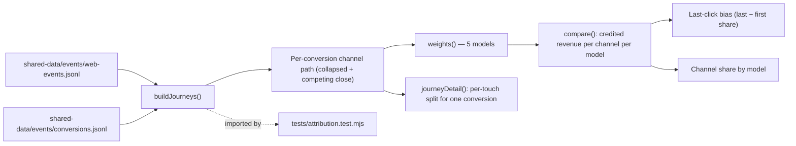
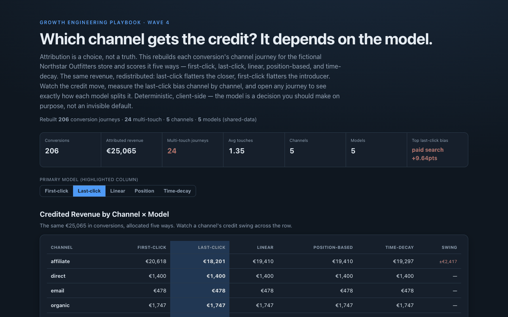

# 19 Attribution Model Comparator

**Wave 4 — Trustworthy Measurement & Attribution.** The measurement layer that
judges everything upstream. It rebuilds each conversion's channel journey and
scores it with five attribution models — first-click, last-click, linear,
position-based, time-decay — to show that the "winning" channel is a modelling
choice, not a fact.

## Problem

Almost every marketing report runs on **last-click by default**, and nobody chose
it — it's just what the tool shows. But last-click flatters whatever channel
happened to be last (usually the closer: paid search, retargeting, direct), and
quietly starves the channels that introduced the customer (organic, affiliate,
social). Swap to first-click and the story inverts. Same conversions, same
revenue, completely different budget conclusions — and teams reallocate real money
on the strength of a default they never examined. The hard part isn't computing
attribution; it's seeing that the model *is* the assumption.

## Expertise Signal

Measurement judgment: attribution as an explicit modelling decision, made visible.
The tool reconstructs multi-touch journeys from raw events (collapsing consecutive
same-channel touches, treating a competing-channel click as a closing touch),
applies all five standard models with correct weightings (including a
half-life time-decay), and lays the credited revenue side by side so the **swing**
per channel is unmissable. It quantifies **last-click bias** channel by channel
(share under last-click minus first-click — positive means an over-credited closer,
negative an under-credited introducer), and lets you open any single journey to see
exactly how each model divides its value. It also resists overclaiming: where the
sample is single-touch, the models agree, and the tool says so.

## Business Impact

Budget follows attribution, so the wrong default silently misallocates spend. Being
explicit about the model protects the channels that actually start journeys and
stops over-investing in the ones that merely finish them. On the bundled event data
(206 conversions, €25k, 24 multi-touch journeys across 5 channels):

- **Same revenue, redistributed.** Paid search is credited **€822 under
  first-click but €3,239 under last-click** — nearly 4× — while affiliate slides
  from €20.6k to €18.2k. Nothing changed but the model.
- **Last-click bias, quantified.** Last-click over-credits paid search by **+9.6
  points of share** and under-credits affiliate by the same — the exact budget you'd
  shift by questioning the default.
- **Journey-level transparency.** Any conversion opens up to show its path
  (e.g. affiliate → paid search → affiliate → paid search) and how each model
  splits the euros — the explanation behind the aggregate.
- **Honest about the data.** Single-channel conversions score identically across
  models by construction; the tool surfaces the multi-touch count so you know how
  much of the picture is actually contested.

## Architecture

Deterministic, client-side, no backend. Journeys are rebuilt from the shared event
streams. The engine is one dependency-free module shared by the UI and the test.



## Quickstart

The app reads `../shared-data/`, so serve the **repo root** over HTTP:

```bash
# from the repository root
python3 -m http.server 8069
# then open http://localhost:8069/19-attribution-model-comparator/
```

**Live demo:**
[aaronwest-repo.github.io/growth-engineering-playbook/19-attribution-model-comparator](https://aaronwest-repo.github.io/growth-engineering-playbook/19-attribution-model-comparator/)

Run the smoke test:

```bash
cd 19-attribution-model-comparator
node tests/attribution.test.mjs
```

## How It Works

1. **Rebuild journeys** — for each conversion, gather the visitor's session touches
   before the conversion (within a lookback), ordered in time, collapsing runs of
   the same channel; a competing-channel click is added as a closing touch.
2. **Weight by model** — first-click (100% first), last-click (100% last), linear
   (even), position-based (40/20/40), and time-decay (exponential, 7-day
   half-life). Weights always sum to 1.
3. **Aggregate** — distribute each conversion's revenue across its touches under
   every model and sum per channel, with each channel's share of the total.
4. **Measure bias** — last-click share minus first-click share per channel,
   ranked, so over-credited closers and under-credited introducers are explicit.
5. **Explain** — the winner/share panel updates with the primary model; the journey
   explorer shows one conversion's path and the euro split each model produces.

## Trade-offs & Scale

- **Rule-based attribution, not a data-driven / Markov / Shapley model.** The five
  models are the standard heuristics; algorithmic attribution needs far more data
  and is far less legible.
- **Journeys reconstructed from sessions.** Touch = a session's entry channel;
  it doesn't parse full clickstreams, view-through, or cross-device identity.
- **Modest multi-touch sample.** 24 of 206 conversions are multi-channel, so the
  aggregate shift is real but bounded; single-channel conversions agree across
  models by design (and the tool says so).
- **Competing-channel handling is a modelling choice.** Treating it as a closing
  touch is defensible for the dedup scenario but is an assumption, not ground truth.
- **No incrementality.** Attribution reallocates observed credit; it does not
  measure whether a touch was *causal* — that's the holdout/lift tool later in this
  wave.
- **Fixed time-decay half-life.** Seven days is a sensible default, not tuned to
  this store's real purchase latency.

## Blog Links

Part of the Measurement & Attribution cluster on
[aaronwest.de/blog](https://aaronwest.de/blog). Articles pending:

- *Attribution Is a Choice, Not a Truth*
- *Why Last-Click Is Lying to Your Budget*
- *First-Click, Last-Click, Linear: A Field Guide*
- *Multi-Touch Attribution Without the Hype*
- *Attribution vs Incrementality*

## Screenshot


