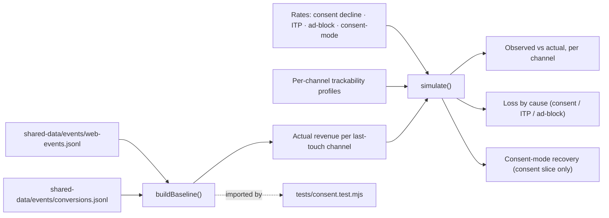
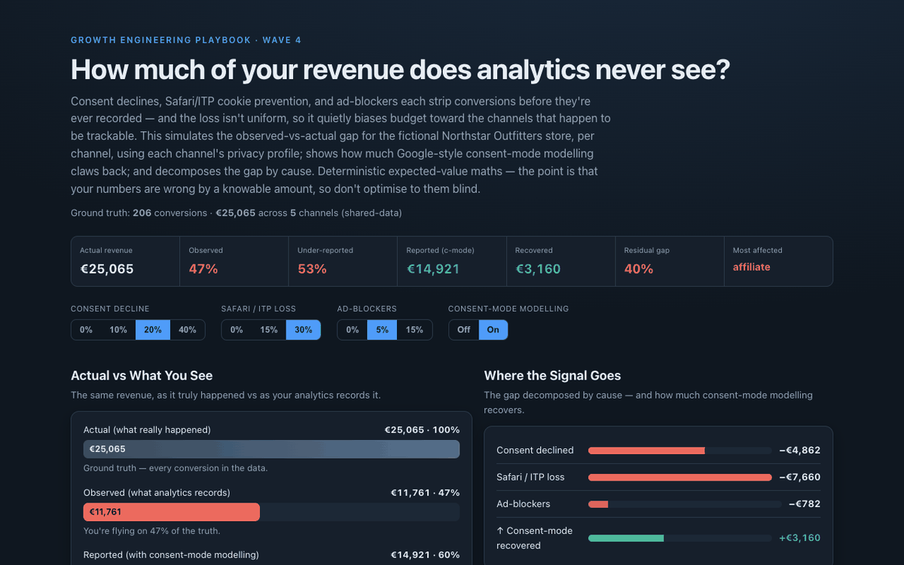

# 20 Consent-Mode & Tracking-Loss Simulator

**Wave 4 — Trustworthy Measurement & Attribution.** The attribution comparator
(case 19) showed the model reallocates *recorded* conversions. This asks the
prior question: how many conversions were recorded at all? It models the
observed-vs-actual gap from consent declines, ITP/cookie loss, and ad-blockers —
by channel — and how much consent-mode modelling recovers.

## Problem

Every dashboard is quietly incomplete. A share of customers decline the consent
banner, Safari and other browsers cap or delete tracking cookies, and ad-blockers
stop the tag firing at all — so conversions happen but are never recorded. Two
things make this dangerous rather than merely annoying: the loss is **large**
(often 20–50% of conversions), and it is **not uniform** — privacy-heavy channels
lose far more signal than logged-in, ad-platform traffic. Optimise to the numbers
on the screen and you'll shift budget toward whatever is easiest to measure, not
whatever actually works. The hard part is knowing the size and shape of the gap
before you act on the data inside it.

## Expertise Signal

Measurement literacy about the data *before* the model. The simulator treats each
channel with its own **trackability profile** (browser and consent mix), so
affiliate and organic — privacy/Safari-heavy — under-report more than paid search
or email. It composes the three loss mechanisms multiplicatively, decomposes the
gap by cause (consent vs ITP vs ad-block) with a sequential split that sums
exactly, and models **consent-mode recovery** correctly — it claws back a fraction
of the *consent-declined* slice only, never the cookie/ad-block losses. And it
names the real risk: differential under-reporting is the same last-click bias from
case 19, one layer down — you punish the channels you can't see.

## Business Impact

Budget follows measured performance, so systematic, uneven under-reporting
misallocates spend and can get a genuinely profitable channel cut for "not
converting." Sizing the gap — and knowing which channels it hits hardest — keeps
decisions honest. On the bundled event data (206 conversions, €25,065, 5 channels):

- **The gap is huge.** At 20% consent decline, 30% ITP loss, and 5% ad-block, only
  **47% of real revenue is observed** — you'd be flying on less than half the truth.
- **Consent mode helps, but doesn't save you.** Modelling recovers the
  consent-declined slice (~€3.2k here), lifting reported revenue to ~60% — the
  cookie and ad-block losses simply stay missing.
- **The loss is lopsided.** Affiliate and organic under-report ~40%+ while paid
  search loses under 20% — so observed data over-credits the trackable channels
  and quietly argues to defund the rest.
- **Cause is visible.** The gap is decomposed into consent, ITP, and ad-block euros,
  so you know whether the fix is a better banner, server-side tagging, or nothing
  you can control.

## Architecture

Deterministic expected-value maths, client-side, no backend. Ground-truth
conversions come from the shared event streams; the model is one dependency-free
module shared by the UI and the test.



## Quickstart

The app reads `../shared-data/`, so serve the **repo root** over HTTP:

```bash
# from the repository root
python3 -m http.server 8070
# then open http://localhost:8070/20-consent-mode-impact-simulator/
```

**Live demo:**
[aaronwest-repo.github.io/growth-engineering-playbook/20-consent-mode-impact-simulator](https://aaronwest-repo.github.io/growth-engineering-playbook/20-consent-mode-impact-simulator/)

Run the smoke test:

```bash
cd 20-consent-mode-impact-simulator
node tests/consent.test.mjs
```

## How It Works

1. **Baseline** — reconstruct each conversion's last-touch channel from the event
   streams and total actual revenue per channel (ground truth).
2. **Apply loss rates** — for each channel, scale the base consent/ITP/ad-block
   rates by that channel's trackability profile, then combine multiplicatively into
   a tracked fraction.
3. **Decompose the gap** — split the loss sequentially into consent, then ITP, then
   ad-block euros, so the parts sum exactly to actual − observed.
4. **Model consent-mode recovery** — recover a fixed fraction of the
   consent-declined loss only; cookie and ad-block losses remain.
5. **Report** — actual vs observed vs reported (with modelling), a per-channel
   under-reporting table sorted by gap, and the decision risk spelled out.

## Trade-offs & Scale

- **Expected-value model, not a simulation.** It applies rates deterministically;
  it doesn't Monte-Carlo individual users, so results are averages.
- **Channel profiles are documented assumptions.** The browser/consent mix per
  channel is illustrative, not measured for this store — tune them to real data.
- **Consent-mode recovery is a single rate.** Real behavioural modelling varies by
  volume, region, and Google's own thresholds; here it's a fixed fraction of the
  consent slice.
- **Last-touch channelisation.** Conversions are bucketed by last-touch source, so
  the gap is shown by closing channel, not full path.
- **No regional / regulatory nuance.** Consent rates differ sharply by geography
  (EU vs US); this uses one global set of rates.
- **Sizes the gap, doesn't close it.** It quantifies loss and recovery; server-side
  tagging, CAPI, and consent-banner UX are the actual fixes.

## Blog Links

Part of the Measurement & Attribution cluster on
[aaronwest.de/blog](https://aaronwest.de/blog). Articles pending:

- *Why Your Tracking Under-Reports*
- *Consent Mode, Explained Without the Hype*
- *ITP, Cookies and the Slow Death of Client-Side Tracking*
- *The Channels You Can't See Are Still Working*
- *Sizing the Gap Before You Cut a Channel*

## Screenshot


