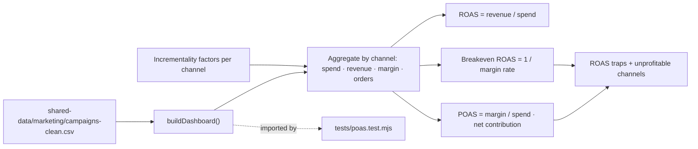
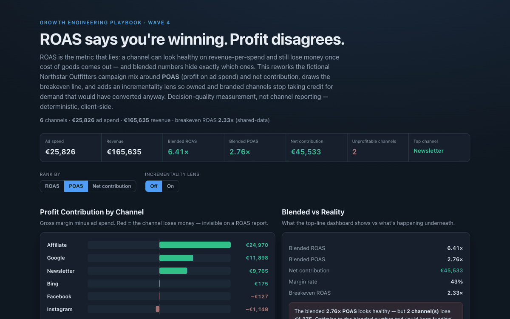

# 21 Channel-Mix POAS Dashboard

**Wave 4 — Trustworthy Measurement & Attribution.** The attribution comparator
(19) showed the model reallocates credit; the consent simulator (20) showed the
data is incomplete. This asks the decision question on top of both: given what you
spend and earn per channel, **which channels actually make money** — measured on
profit, not ROAS.

## Problem

ROAS is the metric that lies. "4× ROAS" sounds like a win, but if your gross margin
is 40% you need roughly **2.5× ROAS just to break even** on the cost of goods — so a
2.3× channel is quietly losing money while its ROAS looks fine. Blended reporting
makes it worse: a healthy overall ROAS hides the individual channels bleeding
underneath it. And last-click revenue over-credits owned and branded channels
(newsletter, brand search) that were going to convert anyway. Teams scale on ROAS,
defund the wrong channels, and never see the profit leak because the dashboard
never showed profit.

## Expertise Signal

Decision-quality measurement: reframing the mix around **POAS (profit on ad
spend)** and **net contribution**, not revenue ratios. The dashboard computes the
**breakeven ROAS** from the margin rate, flags channels that clear a healthy-looking
ROAS but fail on profit ("ROAS traps"), and separates the blended headline from the
per-channel reality. It adds an **incrementality lens** — a documented haircut per
channel — so owned/branded channels stop claiming demand they didn't create,
connecting this to the last-click bias (case 19) and the under-reporting gap
(case 20). The signal is judgment about *what to fund*: profit and incrementality,
not vanity ratios.

## Business Impact

Channel budget is one of the largest controllable spend decisions, and ROAS-based
allocation systematically over-funds low-margin and non-incremental channels. Moving
to POAS and contribution reveals the real picture. On the fictional Northstar
Outfitters mix (€25.8k spend, €166k revenue, 6 channels):

- **Blended hides the leak.** Overall POAS is a healthy-looking **2.76×**, yet
  **two channels are net-negative** — Facebook (2.3× ROAS but 0.98× POAS) and
  Instagram (1.1× ROAS, 0.48× POAS) — together losing money a ROAS report would
  never flag.
- **The breakeven line does the work.** At a 43% margin, a channel needs **2.33×
  ROAS** to profit; Facebook's 2.3× is the textbook trap — above 1×, below breakeven.
- **The engines are clear.** Affiliate (+€25k), Google (+€12k), and newsletter
  (+€10k) drive the contribution — where scale, not more Instagram, belongs.
- **Incrementality changes the ranking.** The lens discounts owned/branded credit,
  flipping a marginal channel (bing) negative and shrinking newsletter's apparent
  return — a reminder that some "returns" are demand you already had.

## Architecture

Deterministic, client-side, no backend. Built from the shared campaign export. The
engine is one dependency-free module shared by the UI and the test.



## Quickstart

The app reads `../shared-data/`, so serve the **repo root** over HTTP:

```bash
# from the repository root
python3 -m http.server 8071
# then open http://localhost:8071/21-channel-mix-poas-dashboard/
```

**Live demo:**
[aaronwest-repo.github.io/growth-engineering-playbook/21-channel-mix-poas-dashboard](https://aaronwest-repo.github.io/growth-engineering-playbook/21-channel-mix-poas-dashboard/)

Run the smoke test:

```bash
cd 21-channel-mix-poas-dashboard
node tests/poas.test.mjs
```

## How It Works

1. **Aggregate** — sum spend, revenue, gross margin, and orders per channel from
   the campaign export.
2. **Compute the honest metrics** — ROAS (revenue/spend), **POAS (margin/spend)**,
   net contribution (margin − spend), CPA, and per-channel margin rate.
3. **Draw the breakeven line** — breakeven ROAS = 1 ÷ blended margin rate; any
   channel below it is losing money regardless of how good its ROAS looks.
4. **Flag the traps** — channels with a healthy ROAS (≥1.5×) but POAS below 1 are
   surfaced as ROAS traps; unprofitable channels are marked.
5. **Apply the incrementality lens** — an optional per-channel haircut discounts
   owned/branded credit to an incremental contribution, changing the ranking.
6. **Contrast blended vs reality** — the top-line numbers next to the per-channel
   truth, with the amount the losing channels quietly cost.

## Trade-offs & Scale

- **Gross-margin POAS, not fully-loaded.** Uses gross margin minus ad spend; a
  complete P&L would fold in fulfilment, returns, and overhead.
- **Incrementality factors are assumptions.** The per-channel haircuts are
  illustrative defaults — real incrementality needs geo/holdout testing (case 22).
- **Last-touch channelisation.** Revenue and margin are credited to the campaign
  source as recorded, inheriting whatever attribution produced them (see case 19).
- **Aggregate, not campaign-level bidding.** It ranks channels, not individual
  campaigns/keywords, and doesn't model diminishing returns as you scale spend.
- **Point-in-time.** No time series, seasonality, or budget-reallocation simulation.
- **CAC uses recorded new-customers.** New-customer counts are as-tagged, subject to
  the same tracking gaps as everything else.

## Blog Links

Part of the Measurement & Attribution cluster on
[aaronwest.de/blog](https://aaronwest.de/blog). Articles pending:

- *ROAS Is the Metric That Lies*
- *POAS: Profit on Ad Spend, Explained*
- *Breakeven ROAS and Why It Matters*
- *Blended Metrics Hide Your Worst Channel*
- *Incrementality vs Reported Return*

## Screenshot


