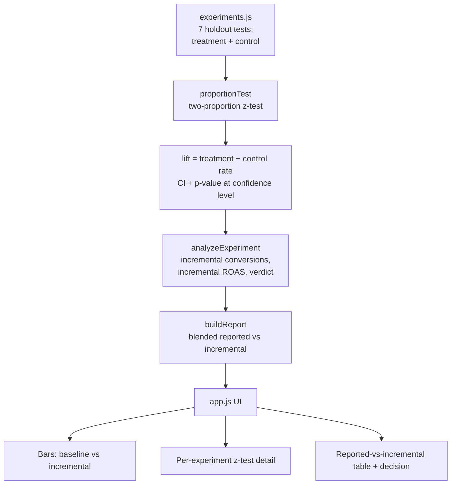
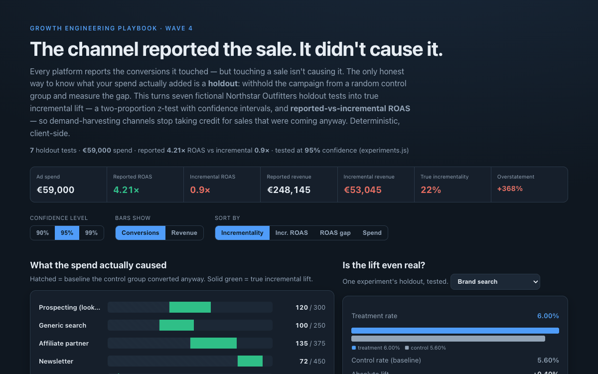

# 22 Holdout vs Observed Lift

**Wave 4 — Trustworthy Measurement & Attribution.** The attribution comparator
(19) showed the *model* reallocates credit; the consent simulator (20) showed the
*data* is incomplete; the POAS dashboard (21) showed ROAS ignores *profit*. This
one asks the question underneath all three: did the spend actually **cause** the
sale, or just get credited for it? The only honest answer is a **holdout**.

## Problem

Every ad platform reports the conversions it touched — and takes credit for all of
them. But a brand-search click from someone already typing your name, or a
retargeting impression served to a shopper who was coming back anyway, "touches" a
sale it didn't cause. Reported ROAS is therefore systematically inflated for
demand-harvesting channels (brand, retargeting, email), and teams scale exactly the
channels that would have converted for free. The reported number and the caused
number are different numbers, and no dashboard shows the second one.

## Expertise Signal

Causal measurement, not reporting. The tool treats each channel as a **holdout
experiment**: a randomly-withheld control group that never saw the campaign
establishes the organic baseline, and true incremental lift is
`treatment rate − control rate` extrapolated over the treated population. It runs a
**two-proportion z-test** with a confidence interval and p-value — so the tool can
say not just *how big* the lift is but *whether it's distinguishable from zero* —
and translates the lift into **incremental ROAS** valued at each channel's average
order value. It distinguishes a well-powered null ("no measurable lift") from a
genuinely underpowered test ("inconclusive — the holdout was too small"), which is
the mistake most in-house incrementality reads make. The signal is judgment about
*causation vs correlation* in spend decisions.

## Business Impact

Incrementality is the difference between growing the business and paying for growth
that was already happening. On the seven fictional Northstar Outfitters holdout
tests (€59k spend, €248k reported revenue, tested at 95% confidence):

- **The program is barely incremental.** Reported ROAS is a healthy-looking
  **4.21×**; measured against the holdouts it collapses to **0.9× incremental ROAS**.
  Reported revenue overstates what the spend actually caused by **+368%** — only
  **~22%** of conversions were genuinely incremental.
- **The "best" channels aren't.** Brand search reports **6.93×** ROAS and proves
  **0.46×** (p = 0.38 — no measurable lift). Retargeting: **4.28× → 0.28×**.
  Newsletter's enormous **7.88×** is only 16% incremental.
- **The real engines look unremarkable.** Prospecting, generic search and the
  affiliate partner report ordinary ~3× ROAS but are the only channels where the
  control group clearly loses — ~40% incremental, p < 0.001.
- **One test can't be acted on at all.** The Instagram awareness holdout was too
  small; its interval spans a real effect *and* none — the right call is to fix the
  experiment, not the budget.

Reallocating from the two harvesting channels toward the proven-incremental ones is
a real profit move that a ROAS dashboard would tell you to do backwards.

## Architecture



The core (`lift.js`) is a dependency-free ES module with no DOM and no network,
imported unchanged by both the browser UI (`app.js`) and the Node smoke test. The
statistics — a normal CDF (Abramowitz & Stegun approximation), a pooled-variance
z-test for significance and an unpooled interval around the observed lift — are
computed from scratch, no libraries.

## Quickstart

```bash
# 1. Run the smoke test (pure Node, no install)
cd 22-holdout-vs-observed-lift
node tests/lift.test.mjs

# 2. Open the UI — serve the repo root so the ES modules resolve
cd ..
python3 -m http.server 8000
# then open http://localhost:8000/22-holdout-vs-observed-lift/
```

Live demo: **https://aaronwest-repo.github.io/growth-engineering-playbook/22-holdout-vs-observed-lift/**

## How It Works

- **Holdout model.** Each experiment carries a `treatment` and `control` group as
  `{users, conversions}`, plus spend and treatment revenue. The control group's
  conversion rate is the counterfactual — what the treated users would have done
  with no campaign.
- **Incremental lift.** `lift = p_treatment − p_control`. Incremental conversions =
  `lift × treated users`; incrementality % = incremental ÷ reported. Incremental
  revenue values those conversions at the treatment group's average order value, and
  incremental ROAS = incremental revenue ÷ spend.
- **Significance.** A two-proportion z-test (pooled variance under H₀) gives the
  z-statistic and two-sided p-value; the confidence interval around the lift uses
  unpooled variance. The **confidence level** control (90 / 95 / 99%) changes the
  interval width and the verdicts — the newsletter test, for instance, is
  significant at 95% but not at 99%.
- **Verdicts.** *Incremental* (significant, ≥35% incremental), *Mostly harvesting*
  (significant but small), *No measurable lift* (well-powered null), *Inconclusive*
  (the interval still admits a real effect — underpowered).

## Trade-offs & Scale

- **Synthetic, pre-aggregated experiments.** The fixture is invented group-level
  results, not raw events, so the demo stays deterministic and inspectable. In
  production the treatment/control counts come from a geo-split or Ghost-ads /
  PSA-holdout platform (or a randomised email holdout you run yourself).
- **A z-test assumes clean randomisation.** Real holdouts fight contamination
  (control users exposed via other channels), network effects, and seasonality; a
  CUPED variance-reduction or a difference-in-differences design tightens the
  estimate. The z-test here is the honest floor, not the ceiling.
- **AOV is held flat per channel.** Incremental orders are valued at the treatment
  AOV; at scale you'd measure incremental *revenue* directly rather than assume the
  incremental basket matches the average.
- **One test ≠ a program.** Incrementality decays and shifts with budget; these are
  point-in-time reads that should be re-run, not set-and-forget multipliers.

## Blog

Part of the [Growth Engineering Playbook](https://github.com/aaronwest-repo/growth-engineering-playbook).
Companion articles live at [aaronwest.de/blog](https://aaronwest.de/blog) — this
demo pairs with the measurement-trust cluster alongside the attribution comparator
(19), consent-mode simulator (20) and POAS dashboard (21).

## Screenshot


