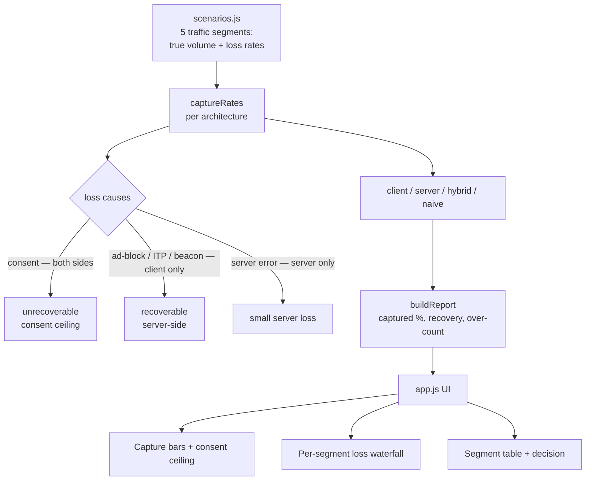
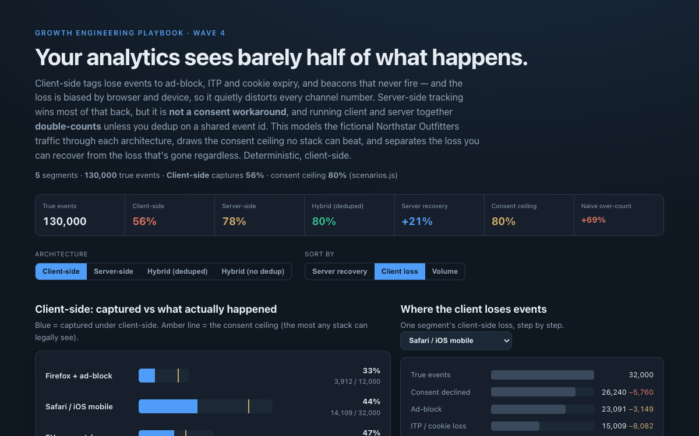

# 23 Server-side vs Client-side Tracking

**Wave 4 — Trustworthy Measurement & Attribution.** The consent simulator (20)
showed *how much* data you lose; this shows *what to do about it* — and why the
obvious fix (server-side tracking) is neither a silver bullet nor a consent
workaround, and quietly introduces a double-counting trap of its own. It closes
the wave: attribution (19) is about crediting, consent (20) and this are about
capture, holdout (22) is about causation.

## Problem

Client-side analytics — the GA4 tag, the pixels — runs in the browser, so it loses
events to ad-blockers, ITP and cookie expiry, and beacons that never fire before
the page unloads. Worse, the loss is **biased**: a Safari/iOS or ad-block-heavy
audience is captured far worse than Chrome/desktop, so every channel and segment
number is distorted by *how* its users browse, not just how they behave. Teams
react by bolting on server-side tracking and assume the numbers are now "fixed" —
but server-side can't cross the consent wall, and running it alongside the client
tag **double-counts every event** unless both sides share an event id and dedup.

## Expertise Signal

Measurement-architecture judgment. The tool models true event volume through four
architectures — client-only, server-only, deduped hybrid (the union), and naive
hybrid (the sum) — decomposing loss into its causes: **consent** (blocks both
sides, unrecoverable), and **ad-block / ITP / beacon-drop** (client-only,
recoverable server-side). It draws the **consent ceiling** no stack can legally
beat, separates recoverable loss from consent loss per segment, and quantifies the
**over-count a naive hybrid reports** — the failure mode most server-side rollouts
ship with. The signal is knowing that server-side is a volume-and-durability play
with a dedup requirement and a consent ceiling, not a "get all your data back"
button.

## Business Impact

Under-counting makes good channels look bad; over-counting makes everything look
good and inflates ROAS. On the fictional Northstar Outfitters traffic (130,000 true
events across five segments):

- **Client-side sees 56%.** Nearly half of reality is missing — and unevenly: the
  Firefox+ad-block segment drops to **33%**, Safari/iOS to **44%**, while
  Chrome/desktop holds **72%**. A campaign skewed to privacy-heavy browsers looks
  worse than it performed.
- **Server-side recovers to 78% (+21pp),** most of it exactly where the client
  bled — the privacy-heavy and Safari segments.
- **Consent is the wall.** No architecture beats the **80%** consent ceiling; in the
  EU-heavy segment it's only **62%**. About **55%** of the client loss is
  recoverable tech loss; the rest is consent and gone regardless.
- **The dedup trap is the expensive one.** Run client + server without event-id
  deduplication and you report **134%** of reality — a **+69%** phantom inflation
  that flatters every conversion and ROAS figure and is worse than the honest
  under-count it replaced.

The right answer is server-side for the volume, **deduped on a shared event id**,
with the consent ceiling treated as a measurement fact — not a bug to engineer
around.

## Architecture



The core (`tracking.js`) is a dependency-free ES module with no DOM and no network,
imported unchanged by both the browser UI (`app.js`) and the Node smoke test.

## Quickstart

```bash
# 1. Run the smoke test (pure Node, no install)
cd 23-server-side-vs-client-tracking
node tests/tracking.test.mjs

# 2. Open the UI — serve the repo root so the ES modules resolve
cd ..
python3 -m http.server 8000
# then open http://localhost:8000/23-server-side-vs-client-tracking/
```

Live demo: **https://aaronwest-repo.github.io/growth-engineering-playbook/23-server-side-vs-client-tracking/**

## How It Works

- **Capture model.** For each segment, `consentKept = 1 − consentDecline` is the
  ceiling. Client survival is `(1−adBlock)(1−ITP)(1−beacon)`; server survival is
  `(1−serverError)`. Client capture = `consentKept × clientSurv`, server capture =
  `consentKept × serverSurv`.
- **Deduped vs naive hybrid.** The deduped hybrid is the **union** —
  `consentKept × (1 − (1−clientSurv)(1−serverSurv))` — an event counts once if
  either side caught it. The naive hybrid is the **sum** of the two reported
  totals, which double-counts the overlap and can exceed 100% of truth.
- **Recoverable vs unrecoverable.** Recoverable loss = consent ceiling − client
  captured (the ad-block/ITP/beacon steps a server can win back). Unrecoverable =
  true − ceiling (consent). The per-segment waterfall walks the client-side losses
  in order so you can see which cause dominates.

## Trade-offs & Scale

- **Rates are documented assumptions, not measurements.** The per-cause loss rates
  are invented to be realistic and deterministic; a real deployment would calibrate
  them from consent logs, a server-vs-client A/A comparison, and known ITP/ad-block
  penetration for its audience.
- **Independence is a simplification.** The union model assumes client and server
  failures are independent within a segment; correlated failures (an outage that
  hits both, or consent that removes both) are partly captured via the shared
  consent term but not exhaustively modelled.
- **Dedup is non-trivial in practice.** A shared `event_id` is necessary but not
  sufficient — clock skew, retries, and late server events need a dedup window; the
  model assumes perfect dedup so the *gap* between naive and correct is the honest
  worst case.
- **Server-side has costs this doesn't price.** Engineering effort, a tagging
  server or CAPI integration, added latency, and reduced client-only signal
  (device/viewport context) are real trade-offs beyond the capture math.

## Blog

Part of the [Growth Engineering Playbook](https://github.com/aaronwest-repo/growth-engineering-playbook).
Companion articles live at [aaronwest.de/blog](https://aaronwest.de/blog) — this
demo completes the measurement-trust cluster with the attribution comparator (19),
consent-mode simulator (20), POAS dashboard (21) and holdout lift tool (22).

## Screenshot


