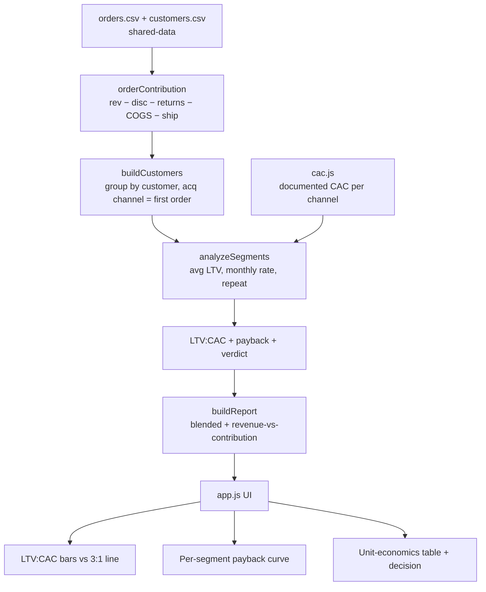
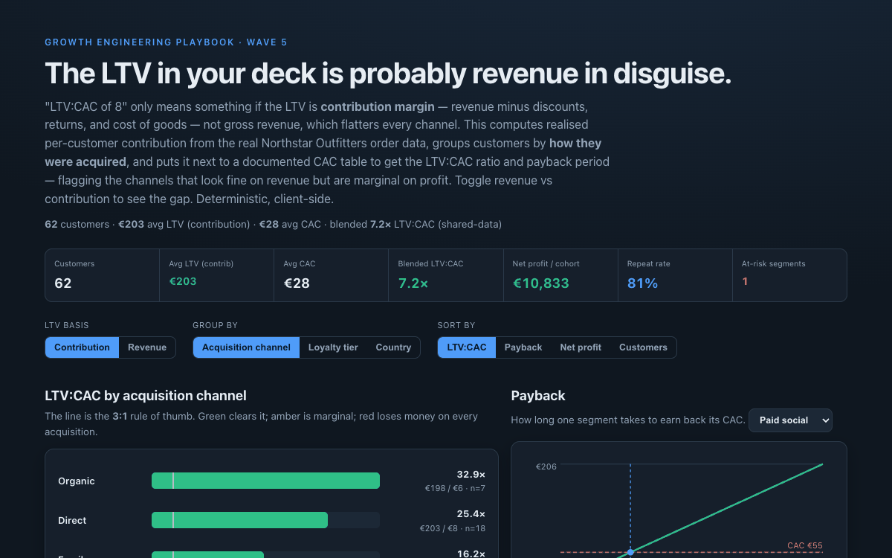

# 24 LTV / CAC / Payback Calculator

**Wave 5 — Growth Planning & Unit Economics.** Wave 4 made measurement honest;
this wave is about what you *do* with it. The first question any budget decision
rests on: is a customer worth more than they cost to acquire, and how long until
you get your money back? This computes it from the real order data — and refuses
to let revenue masquerade as LTV.

## Problem

"Our LTV:CAC is 8:1" is the most confidently-quoted wrong number in growth. The
LTV in the deck is almost always **gross revenue** per customer, which ignores
discounts, returns, and cost of goods — so it flatters every channel by the same
margin it hides. The only figure you can safely compare to acquisition cost is
lifetime **contribution margin**. Teams that skip that comparison over-invest in
channels that look efficient on revenue and are marginal on profit, and they
ignore payback period entirely — so a "healthy" channel quietly ties up cash for
two years before it breaks even.

## Expertise Signal

Unit-economics craft on real, messy order data. The tool derives per-customer
contribution from actual orders (revenue − discounts − returns − COGS − shipping
cost), assigns each customer to the channel that **acquired** them (their first
order), and puts realised LTV next to a documented CAC table to compute LTV:CAC
and payback. It exposes the **revenue-vs-contribution gap** as a toggle, applies
the classic **3:1 rule** and a 12-month payback threshold as verdicts, shows the
customer count per segment so thin numbers are visible, and draws a payback curve
per segment. It also names the two traps unit economics usually walks into:
revenue-inflated LTV, and treating cheap-but-capacity-limited channels (direct,
organic) as if you could buy more of them on demand.

## Business Impact

Acquisition budget is allocated on these two numbers; getting LTV right changes
where the money goes. On the real Northstar Outfitters cohort (62 repeat-capable
customers, 81% repeat rate):

- **Contribution vs revenue is a different decision.** Blended LTV:CAC is a
  healthy **7.2×** on contribution margin — but the same cohort reads far higher
  on revenue, a flattering lift that would justify spend the margin can't support.
- **Paid social is the one to watch.** It has the **lowest** average LTV (~€158)
  *and* the **highest** CAC (~€55), landing at **2.9×** — below the 3:1 rule, with
  the least cushion for rising CPMs.
- **The "free" channels dominate the ratio but not the strategy.** Direct (~25×)
  and organic (~33×) are hugely efficient, but you can't buy more of them at will —
  so the real allocation question is whether the *paid* channels clear the bar,
  and whether their LTV is *incremental* (see the holdout and POAS tools) or demand
  you'd have captured anyway.

The output is a defensible acquisition-budget conversation: fund the paid channels
that clear 3:1 with fast payback, fix or cap the marginal ones, and never let a
revenue-based LTV justify the spend.

## Architecture



The core (`ltv.js`) is a dependency-free ES module with no DOM and no network,
imported unchanged by the browser UI (`app.js`) and the Node smoke test. LTV comes
from the real order data; only CAC is an assumption, and it lives in one small
file so it's explicit and easy to change.

## Quickstart

```bash
# 1. Run the smoke test (pure Node, no install)
cd 24-ltv-cac-payback-calculator
node tests/ltv.test.mjs

# 2. Open the UI — serve the repo root so the CSV fetches resolve
cd ..
python3 -m http.server 8000
# then open http://localhost:8000/24-ltv-cac-payback-calculator/
```

Live demo: **https://aaronwest-repo.github.io/growth-engineering-playbook/24-ltv-cac-payback-calculator/**

## How It Works

- **Contribution, not revenue.** Each order's contribution is
  `gross − discount + shipping_revenue − product_cost − shipping_cost − returned`.
  A customer's LTV is the sum across their orders; the **basis** toggle swaps in
  net revenue so you can see how much that overstates the ratio.
- **Acquisition attribution.** Each customer is grouped by the channel of their
  earliest order — the channel that acquired them — so LTV is compared to the CAC
  that actually bought them.
- **LTV:CAC + payback.** `LTV:CAC = avg LTV ÷ CAC`; `payback = CAC ÷ avg monthly
  contribution`. Verdicts apply the 3:1 rule and a 24-month slow-payback flag.
- **Grouping.** Segment by acquisition channel, loyalty tier, or country; for
  non-channel groupings CAC is blended by each segment's channel mix.
- **Payback curve.** Cumulative contribution at the segment's average monthly rate
  against the CAC line — an average-rate projection, labelled as such (real cohort
  triangles are the next tool's job).

## Trade-offs & Scale

- **Realised, not projected.** This is contribution earned *to date*, not a
  forward LTV. A young cohort will understate its eventual value; a full model
  projects future orders from a retention curve — deliberately left to the cohort
  projection tool so this one stays a clean, auditable snapshot.
- **CAC is an assumption.** The per-channel costs are documented planning numbers,
  not measured spend; a real deployment wires in actual channel spend ÷ new
  customers over a matched window (and should reconcile with the incrementality
  view, since blended CAC over-credits demand-harvesting channels).
- **Small segments are noisy.** With ~10 customers per channel the averages move on
  a few big spenders; the customer count is shown per row for exactly this reason,
  and at scale you'd add confidence intervals or a Bayesian shrink toward the
  blended mean.
- **First-touch acquisition is a simplification.** Attributing a customer to their
  first order's channel ignores multi-touch acquisition journeys (the attribution
  comparator's domain).

## Blog

Part of the [Growth Engineering Playbook](https://github.com/aaronwest-repo/growth-engineering-playbook).
Companion articles live at [aaronwest.de/blog](https://aaronwest.de/blog) — this
opens the planning-and-unit-economics cluster that builds on the measurement-trust
tools (attribution 19, holdout 22, POAS 21).

## Screenshot


