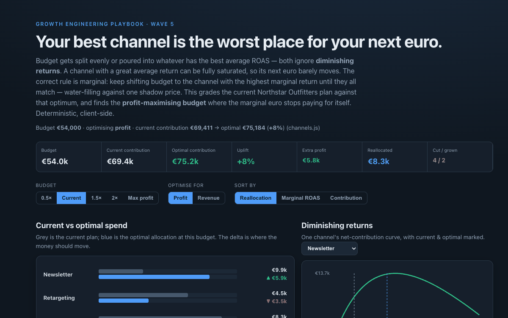

# 25 Marketing Budget Allocator

**Wave 5 — Growth Planning & Unit Economics.** The LTV/CAC tool (24) said which
customers are worth acquiring; this decides how much to spend on each channel to
get them. It's the optimisation payoff of the whole measurement stack — but only
as honest as the response curves you feed it.

## Problem

Budget allocation is the largest controllable growth lever, and it's usually done
two wrong ways: split evenly, or poured into the channel with the best *average*
ROAS. Both ignore **diminishing returns**. A channel with a great blended ROAS can
be fully saturated — its next euro barely moves — while an underfunded channel is
still on the steep part of its curve. Optimising on average ROAS systematically
over-funds saturated channels and starves the ones with room to grow, and nobody
computes the budget at which the marginal euro stops paying for itself.

## Expertise Signal

Marginal thinking, made concrete. Each channel is a diminishing-returns response
curve (`revenue = vmax·(1 − e^(−spend/k))`); the tool allocates a fixed budget by
**water-filling** — bisecting a single shadow price so every funded channel ends
at the same marginal return, which is the Lagrangian optimum. It also solves the
**unconstrained** problem: spend each channel until its marginal profit hits zero,
giving the profit-maximising budget and the breakeven marginal ROAS. It grades the
current plan against the optimum, exposes the **profit-vs-revenue objective**
(revenue-maximising over-funds low-margin channels), and — critically — flags that
the whole exercise is only valid on *incremental* curves, not last-click revenue,
tying it back to the holdout and POAS tools.

## Business Impact

Reallocation is free money — same budget, more profit — and the tool quantifies it.
On the fictional Northstar Outfitters mix (six channels, €54k current budget):

- **+8% more contribution from the same €54k,** just moved — roughly €5.8k of
  profit the current plan leaves on the table.
- **The moves are counterintuitive by ROAS, obvious by margin.** Newsletter (high
  margin, badly underfunded) nearly triples; retargeting and paid social — great on
  paper, saturated in reality — get cut. The optimiser equalises marginal ROAS
  across everything it funds.
- **There's a right budget, not just a right split.** The profit-maximising budget
  sits *above* the current spend (~€64k) because two channels are underfunded — but
  every euro past that point destroys contribution.
- **Objective matters.** Optimising for revenue instead of profit spends more on
  low-margin channels and leaves contribution on the table — the same margin
  blindness the POAS dashboard flags.

## Architecture

```mermaid
flowchart TD
  A[channels.js<br/>vmax, k, margin, current spend] --> B[response = vmax·(1−e^-s/k)<br/>diminishing returns]
  B --> C[marginalProfit = margin·dResp/ds − 1]
  C --> D{budget mode}
  D -->|fixed| E[allocateBudget<br/>water-fill shadow price λ]
  D -->|max| F[profitMaxSpend<br/>λ = 0]
  E --> G[evalPlan: current vs optimal]
  F --> G
  G --> H[buildReport<br/>uplift, reallocation, actions]
  H --> I[app.js UI]
  I --> J[Current vs optimal spend bars]
  I --> K[Per-channel response curve]
  I --> L[Reallocation table + decision]
```

The core (`allocator.js`) is a dependency-free ES module with no DOM and no
network, imported unchanged by the browser UI (`app.js`) and the Node smoke test.
The optimiser is a from-scratch bisection on the Lagrange multiplier — no solver
library.

## Quickstart

```bash
# 1. Run the smoke test (pure Node, no install)
cd 25-marketing-budget-allocator
node tests/allocator.test.mjs

# 2. Open the UI — serve the repo root so the ES modules resolve
cd ..
python3 -m http.server 8000
# then open http://localhost:8000/25-marketing-budget-allocator/
```

Live demo: **https://aaronwest-repo.github.io/growth-engineering-playbook/25-marketing-budget-allocator/**

## How It Works

- **Response curve.** `response(s) = vmax·(1 − e^(−s/k))`. The first euro returns
  `margin·vmax/k` in gross profit; each euro after returns less. Net contribution is
  `margin·response(s) − s`.
- **Fixed-budget optimum (water-filling).** At the optimum every funded channel has
  the same marginal profit λ: `s = k·ln(margin·vmax / (k·(1+λ)))`. The allocator
  bisects λ until total spend equals the budget — moving budget toward higher
  marginal return until it all matches.
- **Profit-max budget.** Set λ = 0: spend each channel until its marginal profit is
  zero. Sum is the budget beyond which the marginal euro loses money.
- **Objective toggle.** "Profit" uses margin in the marginal return; "revenue"
  ignores it, so the optimiser over-funds low-margin channels — more revenue, less
  contribution.

## Trade-offs & Scale

- **The curves are the model's soul, and they're assumptions here.** Real response
  curves are fit from spend-vs-response history (a media-mix model or geo-lift
  experiments), with confidence intervals; the shape (`1 − e^(−s/k)`) is one
  reasonable form among several (Hill, power, log).
- **Feed it incremental curves, not last-click.** If the response is measured on
  last-click revenue it will happily optimise spend into demand you'd have captured
  anyway — the curves must be built on holdout-measured lift (case 22) to be safe.
- **Static and independent.** It ignores cross-channel effects (upper-funnel social
  lifting branded search), time lags/adstock (case 26's job), and audience overlap;
  it's a single-period allocation, not a flighting plan.
- **A point optimum, not a policy.** Curves shift with creative, seasonality and
  competition; the allocation should be re-fit and re-run, not frozen.

## Blog

Part of the [Growth Engineering Playbook](https://github.com/aaronwest-repo/growth-engineering-playbook).
Companion articles live at [aaronwest.de/blog](https://aaronwest.de/blog) — this
continues the planning cluster (LTV/CAC 24) and leans on the measurement-trust
tools (POAS 21, holdout 22).

## Screenshot


