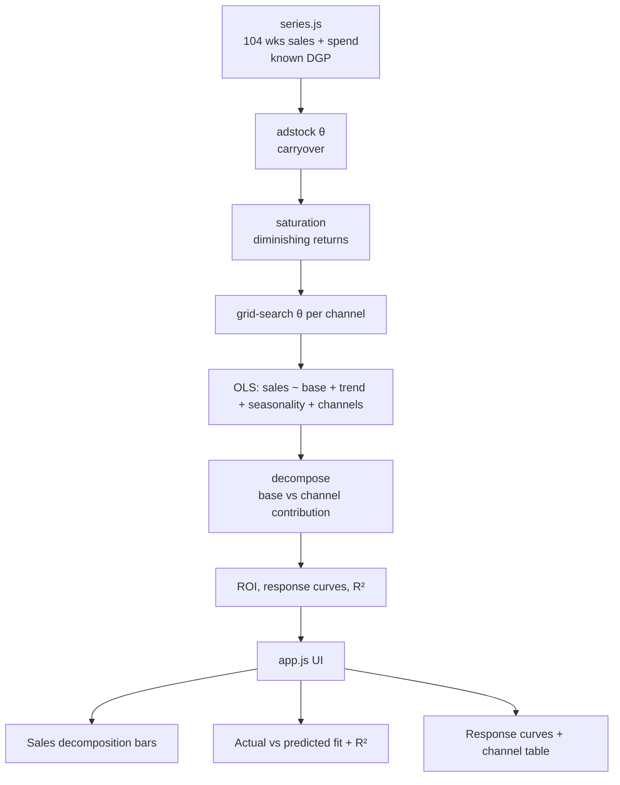

# 26 Marketing Mix Model (lite)

**Wave 5 — Growth Planning & Unit Economics.** Attribution (19) splits credit
among clicks; the holdout (22) proves one channel's lift; the allocator (25)
spends against response curves. This fits those curves the top-down way — a
marketing mix model that decomposes total sales into base and channels from time
series alone, no user-level tracking required.

## Problem

Every other measurement tool needs cookies, clicks, or an experiment. MMM answers
the question from the top: given two years of weekly sales and spend, how much of
revenue did marketing actually *cause*, and how much is **base** — demand that
arrives with no spend at all? Done naively (regress sales on this week's spend) it
gets two things badly wrong: it ignores **carryover** (a brand campaign sells for
weeks after it runs) and **diminishing returns** (the tenth euro does less than the
first), so it mis-reads both which channels work and how hard to push them. And
because it's a regression on observational data, it's easy to over-trust.

## Expertise Signal

A genuine, if lite, MMM built from scratch — no libraries. It applies **geometric
adstock** (carryover that decays by θ each week) and a **saturation** transform
(diminishing returns), **grid-searches the carryover** per channel, and fits base
(level + linear trend + annual Fourier seasonality) plus channels by **ordinary
least squares** (normal equations solved with Gaussian elimination). It decomposes
sales into base vs channel contributions, derives each channel's ROI and response
curve, and reports model fit (R², actual vs predicted). Crucially it's honest about
what a regression can and can't claim: a model-specification toggle shows how
dropping adstock or saturation degrades the fit and distorts ROI, and the tool
states plainly that MMM is **correlational** — validate against holdout experiments
(case 22), don't treat it as causal truth.

## Business Impact

MMM is how you set budget when you can't track users end-to-end (privacy, offline,
brand). On two years of fictional Northstar Outfitters data the model recovers the
known generating process almost exactly:

- **Base is the majority of sales.** ~**52%** of revenue is organic base that
  arrives with zero spend — so "marketing ROAS on total revenue" would be off by
  nearly 2×. Only ~48% is marketing-driven.
- **Carryover changes the verdict.** Paid social has the longest adstock
  (θ ≈ 0.6, **+150%** of its effect lands in later weeks) and the best modelled
  ROI (~1.7×) — judged on same-week sales it would look far worse than it is.
- **Model spec is not a detail.** The full model fits at **R² ≈ 0.995**; the naive
  raw-spend model drops to ~0.96 and mis-estimates carryover and diminishing
  returns — enough to point the budget the wrong way.
- **It recovers ground truth.** Because the series is generated from a known
  process, the fit's adstock θ and channel ROIs land within a few points of the
  true values — evidence the estimation works, not just fits.

The output feeds the budget allocator (25) with response curves — but only after
its contributions are sanity-checked against experiments.

## Architecture



The core (`mmm.js`) is a dependency-free ES module with no DOM and no network,
imported unchanged by the browser UI (`app.js`) and the Node smoke test. The OLS
solver, adstock, saturation, and grid search are all from scratch.

## Quickstart

```bash
# 1. Run the smoke test (pure Node, no install)
cd 26-mmm-lite
node tests/mmm.test.mjs

# 2. Open the UI — serve the repo root so the ES modules resolve
cd ..
python3 -m http.server 8000
# then open http://localhost:8000/26-mmm-lite/
```

Live demo: **https://aaronwest-repo.github.io/growth-engineering-playbook/26-mmm-lite/**

## How It Works

- **Adstock.** `a[t] = spend[t] + θ·a[t-1]` — each week's spend keeps working at a
  decaying rate. θ is grid-searched per channel; the total effect multiplier is
  `1/(1-θ)`, shown as "carryover".
- **Saturation.** `1 − e^(−a/k)` with `k` scaled to the channel's mean spend — the
  response curve bends over, so more spend returns less.
- **Fit.** For each combination of per-channel θ, OLS regresses weekly sales on
  `[1, trend, sin(annual), cos(annual), transformed channels]`; the combination
  with the best penalised R² wins (negative channel coefficients are penalised as
  poorly identified).
- **Decomposition.** Base = intercept + trend + seasonality; each channel's
  contribution = its coefficient × its transform. ROI = channel contribution ÷
  spend. The response curve shows steady-state contribution vs weekly spend.

## Trade-offs & Scale

- **Correlational, not causal.** MMM fits history; it can't separate two channels
  that always move together, and it will credit whatever correlates with sales.
  The contributions are priors to **validate with holdout/geo experiments** (case
  22), then blend (a "calibrated MMM").
- **The transforms are simplifications.** Real MMMs fit the saturation scale (Hill
  parameters) as well as θ, add price/promo/weather/competitor regressors, and
  often go Bayesian for uncertainty intervals; this grid-searches θ and fixes the
  saturation scale to keep it inspectable.
- **Weekly, single-region, two years.** Short series and collinear spend make
  coefficients unstable; production MMMs use more history, cross-sectional (geo)
  variation, and regularisation. The synthetic series here is deliberately
  well-conditioned so the mechanics are legible.
- **No uncertainty shown.** Point estimates only; a real deliverable carries
  credible intervals so you know which channels are actually distinguishable.

## Blog

Part of the [Growth Engineering Playbook](https://github.com/aaronwest-repo/growth-engineering-playbook).
Companion articles live at [aaronwest.de/blog](https://aaronwest.de/blog) — this
extends the planning cluster (LTV/CAC 24, allocator 25) and leans on the
measurement-trust tools (attribution 19, holdout 22).

## Screenshot


