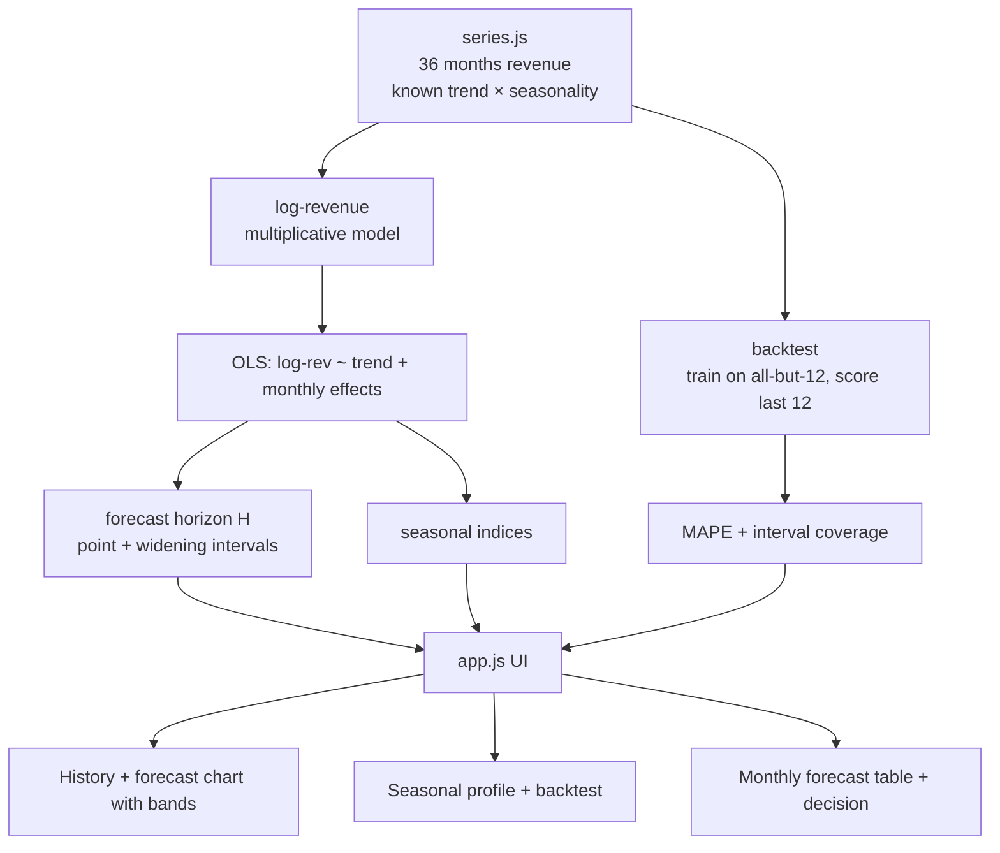
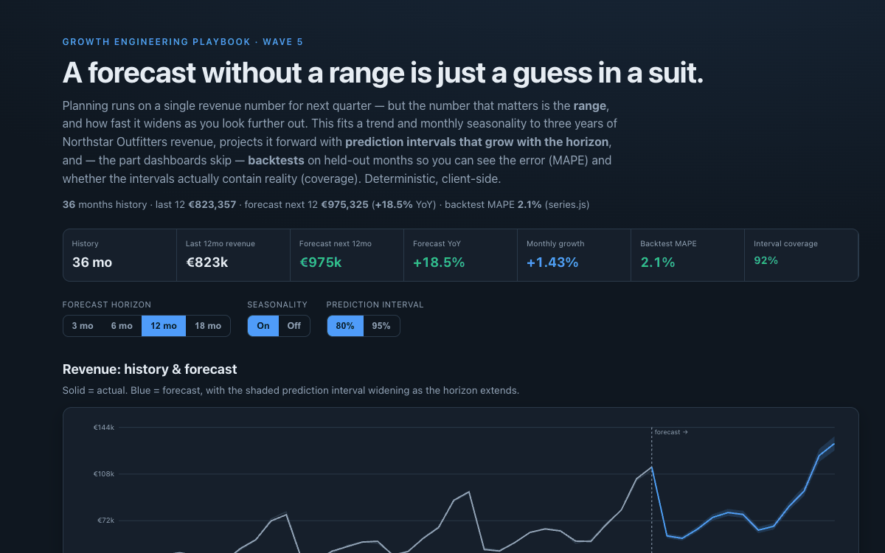

# 27 Revenue Demand Forecast

**Wave 5 — Growth Planning & Unit Economics.** Unit economics (24) and allocation
(25, 26) decide where money goes; this decides how much there'll be. It's the
planning number every other decision leans on — with the one thing planning
numbers usually lack: a calibrated range.

## Problem

Budgets, inventory buys, and hiring plans run on a single revenue figure for next
quarter, presented as if it were a fact. Two failures follow. First, no interval:
a forecast without a range can't tell you whether to plan for the base case or
hedge the downside, and the range should *widen* with the horizon — you know next
month far better than next December. Second, no validation: forecasts are rarely
backtested, so nobody knows if the model is off by 3% or 30%, and a confident line
on a chart gets trusted regardless.

## Expertise Signal

Forecasting done honestly, from scratch. The model fits **log-revenue** with a
linear trend and **monthly seasonal effects** by least squares (so growth is
multiplicative and seasonality is a percentage swing, as revenue actually behaves),
projects forward, and attaches **prediction intervals that widen with the
horizon** from the residual spread. Crucially it **backtests**: it trains on all
but the last year, forecasts the held-out months, and reports **MAPE** (how far off)
and **interval coverage** (did the band actually contain reality) — the difference
between a calibrated forecast and a decorative one. A seasonality toggle shows how
much accuracy an averages-only view throws away, and the tool is explicit that this
is a trend extrapolation, blind to shocks it hasn't seen.

## Business Impact

The forecast and its range are the inputs to every downstream plan. On three years
of fictional Northstar Outfitters revenue, the model recovers the known process and
validates cleanly:

- **A range, not a point.** Next 12 months forecast to ~**€975k** (**+18.5%** on the
  trailing year at ~**1.4%/month** trend) — but next month carries a tight interval
  while a year out is several times wider. Plan the near term to the point, the far
  term to the band.
- **Seasonality is where the money moves.** December runs ~**1.5×** the monthly
  average and February ~**0.8×** — a ~2× swing that the annual total hides entirely,
  and exactly where inventory and cash-flow planning succeed or fail.
- **It's trustworthy because it's tested.** On months it never saw, MAPE is ~**2%**
  and the interval covered ~**92%** of actuals; drop seasonality and the error jumps
  — evidence the seasonal structure is real, not curve-fitting.

The output is a plan-ready forecast with a defensible range and a stated error bar —
not a single number pretending to certainty.

## Architecture



The core (`forecast.js`) is a dependency-free ES module with no DOM and no network,
imported unchanged by the browser UI (`app.js`) and the Node smoke test. The OLS
solver, seasonal decomposition, interval construction and backtest are all from
scratch — no stats library.

## Quickstart

```bash
# 1. Run the smoke test (pure Node, no install)
cd 27-revenue-demand-forecast
node tests/forecast.test.mjs

# 2. Open the UI — serve the repo root so the ES modules resolve
cd ..
python3 -m http.server 8000
# then open http://localhost:8000/27-revenue-demand-forecast/
```

Live demo: **https://aaronwest-repo.github.io/growth-engineering-playbook/27-revenue-demand-forecast/**

## How It Works

- **Model.** `log(revenue) ~ intercept + trend·t + monthly dummies`, fit by OLS.
  Working in log space makes growth multiplicative (`e^trend − 1` per month) and
  seasonality a percentage effect. Seasonal indices are `e^effect`, normalised to
  mean 1.
- **Intervals.** The residual standard deviation in log space sets the band; it's
  scaled by `√(1 + 0.1·h)` so the interval widens with horizon `h`, and by the
  z-score for the chosen confidence (80% or 95%).
- **Backtest.** Train on the first `N−12` months, forecast the last 12, then score
  MAPE (mean absolute % error) and coverage (share of actuals inside the interval).
  Coverage near the nominal level means the uncertainty is honest.

## Trade-offs & Scale

- **A trend extrapolation, not an oracle.** It assumes the future rhymes with the
  past; a promotion, stock-out, price change, or demand shock lives outside these
  bands. Pair it with the marketing tools (MMM 26, allocator 25) for the drivers it
  can't see.
- **Short history, simple seasonality.** Three years barely covers annual
  seasonality and can't see multi-year cycles; monthly dummies assume a stable
  seasonal shape. Production forecasts add holidays, promotions, and price as
  regressors, and often use ETS/ARIMA or a Bayesian structural model with proper
  interval calibration.
- **Point-level intervals only.** The bands are per-month; a real cash plan also
  needs the interval on the *cumulative* total, which compounds differently.
- **One series.** Real demand planning forecasts by SKU/category/region and
  reconciles the hierarchy — deliberately out of scope to keep the mechanics legible.

## Blog

Part of the [Growth Engineering Playbook](https://github.com/aaronwest-repo/growth-engineering-playbook).
Companion articles live at [aaronwest.de/blog](https://aaronwest.de/blog) — this
sits in the planning cluster alongside LTV/CAC (24), the budget allocator (25) and
the marketing mix model (26).

## Screenshot


