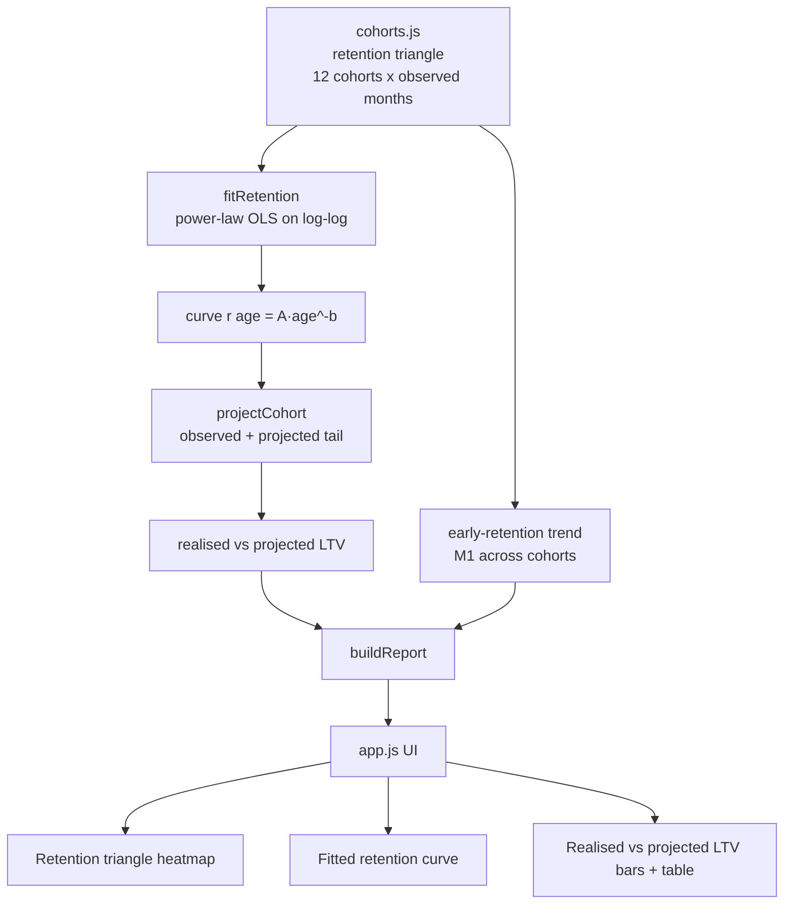
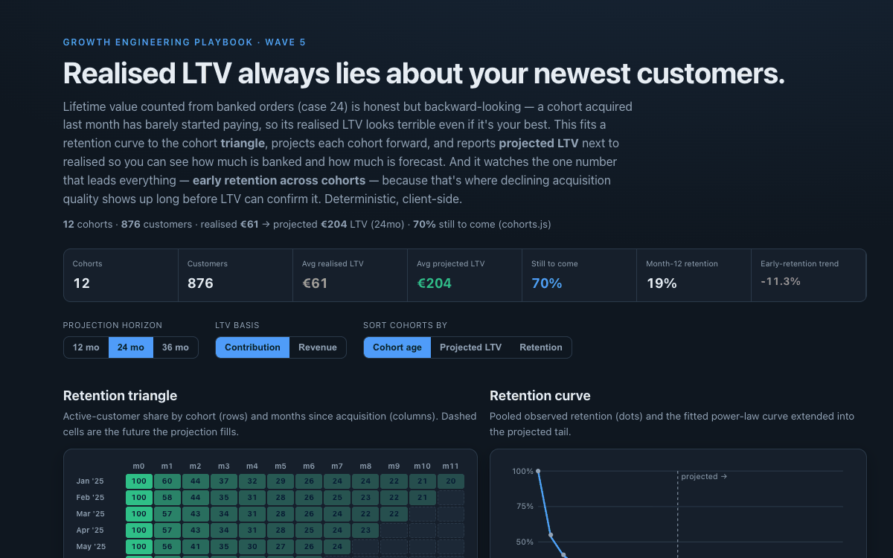

# 28 Cohort Retention & LTV Projection

**Wave 5 — Growth Planning & Unit Economics.** The LTV/CAC tool (24) measured
*realised* lifetime value — money already banked. This is its forward-looking
other half: fit the retention curve, project each cohort's tail, and get the LTV a
customer will *actually* reach — the number acquisition decisions really need. It
closes Wave 5, and the playbook.

## Problem

Realised LTV is honest but it always libels your newest customers: a cohort
acquired last month has barely started buying, so its banked value looks dismal
even if it's your best-retaining cohort ever. Judge acquisition on realised LTV and
you kill good paid channels on a payback report, because most of their value hasn't
arrived yet. And the signal that actually predicts a cohort's fate — **early
retention** — is buried; teams notice quality decline only quarters later, in LTV,
when it's expensive to fix.

## Expertise Signal

Cohort analysis done properly. It reads the classic **retention triangle** (each
cohort observed for a different number of months), fits a **power-law retention
curve** (`r(age) = A·age^(-b)`) by least squares on the pooled log-log data,
weighted by cohort size, and **projects each cohort forward** to a chosen horizon —
using observed retention where it exists and the fitted curve beyond. It reports
**realised vs projected LTV** side by side so it's always clear what's banked and
what's forecast, and it isolates the leading indicator most tools miss: the
**month-1 retention trend across cohorts**, which flags declining acquisition
quality long before projected LTV can (young cohorts borrow the pooled tail, so LTV
converges — early retention is where the truth shows first). It's explicit that the
projection is a forecast to be validated as cohorts mature.

## Business Impact

Projected LTV is the number that belongs next to CAC; realised LTV under-counts
every cohort still in flight. On twelve fictional monthly cohorts (876 customers):

- **Most value is still ahead.** Realised LTV averages just **~€61**, but projected
  to 24 months it's **~€204** — **~70% still to come**. The newest cohort's realised
  LTV is near zero while its projected value matches the rest; on realised numbers
  you'd write it off.
- **The retention curve is recovered, not assumed.** The fit lands at
  `r ≈ 0.54·age^(-0.42)` (R² ≈ 0.98) — month-1 retention ~54%, month-12 ~19% —
  close to the true generating process.
- **Early retention is the alarm.** Month-1 retention is drifting down across
  cohorts (~**−11%**, from ~58% in the oldest to ~52% in the newest) — a real
  acquisition-quality decline that projected LTV can't yet confirm, because it
  shows up in the first month long before the tail.

The output pairs with the realised LTV/CAC tool (24) to give payback its honest
numerator, and feeds the retention assumption behind every forward plan.

## Architecture



The core (`retention.js`) is a dependency-free ES module with no DOM and no
network, imported unchanged by the browser UI (`app.js`) and the Node smoke test.
The curve fit and projection are from scratch.

## Quickstart

```bash
# 1. Run the smoke test (pure Node, no install)
cd 28-cohort-retention-projection
node tests/retention.test.mjs

# 2. Open the UI — serve the repo root so the ES modules resolve
cd ..
python3 -m http.server 8000
# then open http://localhost:8000/28-cohort-retention-projection/
```

Live demo: **https://aaronwest-repo.github.io/growth-engineering-playbook/28-cohort-retention-projection/**

## How It Works

- **The triangle.** Each cohort is observed for a different number of months
  (oldest full, newest just month 0) — the cells that don't exist yet are the
  future the projection fills.
- **Curve fit.** Retention for age ≥ 1 is fit as `r = A·age^(-b)` by OLS on
  `log(retention) ~ log(age)`, pooled across cohorts and weighted by cohort size;
  age 0 is 1 by definition.
- **Projection.** For each cohort, cumulative value = Σ over months of
  `retention × revenue-per-active × margin`, using observed retention where
  available and the fitted curve beyond, out to the horizon (12 / 24 / 36 months).
  Realised = the observed portion; projected = the full horizon.
- **Leading indicator.** Month-1 retention is compared across cohorts that have
  reached month 1 — the earliest read on whether new acquisition is retaining as
  well as old.

## Trade-offs & Scale

- **A projection is a forecast.** The tail beyond a cohort's observed months is the
  fitted curve, not data; a young cohort's projected LTV is only as good as the
  pooled curve, and should be re-checked as it matures. The tool keeps realised and
  projected separate precisely so the forecast is never mistaken for fact.
- **One global curve.** It fits a single retention shape and lets cohorts differ by
  their observed points; a richer model fits per-cohort or per-segment curves (or a
  shifted-beta-geometric / BG-NBD model) to capture heterogeneity in churn.
- **Retention as a single active-share.** Real cohort value also varies by
  order frequency and basket size over age; here revenue-per-active is treated as
  roughly flat. Margin is a documented assumption, as in the LTV/CAC tool.
- **No confidence bands.** Point projections only; a production version carries
  intervals that widen for younger cohorts, since they extrapolate further.

## Blog

Part of the [Growth Engineering Playbook](https://github.com/aaronwest-repo/growth-engineering-playbook).
Companion articles live at [aaronwest.de/blog](https://aaronwest.de/blog) — this is
the forward-looking half of the unit-economics pair with the realised LTV/CAC
calculator (24), and completes the planning wave.

## Screenshot


