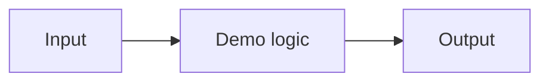

# CLAUDE.md — growth-engineering-playbook

## What this repo is

Public portfolio of small, runnable use cases demonstrating e-commerce growth engineering: automation, chatbots/RAG, AI concepts, CRO, affiliate/performance-marketing tracking, customer data, web performance, SEO/SEA. Each use case pairs with articles on aaronwest.de/blog. Audience: recruiters, clients, founders, agencies, and practitioners skimming GitHub.

The portfolio position is: practical e-commerce growth engineering, demonstrated with runnable tools instead of slideware. Build every demo to show judgment, not just technical output. The role signal is senior e-commerce / marketing technology practitioner: someone who can translate commercial growth problems into maintainable systems.

## Hard rules

- **Showcase, not product.** Simple beats clever. If a use case grows beyond ~3 days of effort, cut scope.
- **Expert signal over feature count.** Every demo must make one professional judgment visible: what to measure, what to automate, what to trust, what to reject, or which trade-off matters.
- **Opinionated, not generic.** Avoid generic dashboards, generic AI wrappers, and generic CRUD. The demo should expose a real e-commerce growth failure mode or decision pattern.
- **One-command run** from fresh clone: `npm start` / `python app.py` / `docker compose up`. Under 60 seconds to a working demo.
- **No paid services.** AI features default to Ollama (local); optional OpenAI-compatible key via env var only.
- **AI demos must have an inspectable fallback.** If Ollama/model download is unavailable, provide cached sample outputs, mock mode, or deterministic demo mode so reviewers can inspect the workflow without pulling a large model.
- **No secrets, ever.** `.env*` is gitignored; configs ship as `.env.example`. No AWS bucket names or distribution IDs.
- **No employer, client, private-project, or unrelated-brand references.** Sample data is invented.
- **English** for all code and READMEs.
- Shared sample catalog and reusable demo data live in `shared-data/` — reuse them, don't invent new datasets per use case.

## Per-use-case structure

```
NN-use-case-name/
├── README.md        # Problem → Expertise signal → Diagram → Quickstart → How it works → Trade-offs & Scale → Blog links
├── screenshot.png   # or demo.gif
├── sample-data/     # if not using shared-data/
├── tests/           # smoke tests where useful
└── src/ (or flat)
```

## Definition of Done (all eight, no exceptions)

1. One-command run from fresh clone works
2. README complete with blog article links and a clear expertise signal
3. Screenshot/GIF included
4. Secrets/personal-data check passed
5. Mermaid architecture or workflow diagram included in the README
6. **Trade-offs & Scale** section explains what the demo deliberately does not solve
7. Minimal smoke test exists and is wired into CI where practical
8. GitHub Pages deploy for static demos (where sensible)

A generic trade-off section is a DoD failure. It must name a real constraint in this demo and what would change at production scale.

Before every push, verify commit identity with:

```bash
git config --local --list | grep '^user\.'
git log --format='%an <%ae>' --max-count=20
```

## README quality bar

Every use-case README should answer these questions quickly:

- What commercial or operational problem does this demonstrate?
- What professional judgment does the demo make visible?
- What failure mode does it help avoid?
- What is the business impact in plain language or approximate euros/time saved?
- How can a reviewer run it in one command?
- What are the trade-offs and what would change at production scale?
- Which blog articles explain the thinking behind it?

Do not write README copy as if the project is a SaaS product. Write it as a case-study artifact for a portfolio.

Recommended use-case README structure:

~~~markdown
# NN Use Case Name

Short one-paragraph summary.

## Problem

## Expertise Signal

## Business Impact

## Architecture



## Quickstart

## How It Works

## Trade-offs & Scale

## Blog Links

## Screenshot
~~~

## Workflow

- One use case per session, on a feature branch, squash-merged when DoD is met.
- The build spec is pasted into the session prompt — build to spec, don't expand scope.
- Verify the demo actually runs before claiming done (fresh-clone test).
- Add or update minimal CI as part of the use case. A smoke test is enough when the project is small.
- Keep CI green from the skeleton commit onward. Add root-level lint/check scripts before the first use case.
- Prefer small, inspectable implementations over framework-heavy code.
- When a design choice matters, explain it in the README instead of hiding it in code.
- Do not copy real production scripts into this repo and clean them afterward. For infrastructure demos, write a public-safe template from scratch.
- After a use case ships, tag a release such as `v0.1-ab-test-analyzer` with short notes and blog links.

## Tech defaults

- Frontend demos: plain HTML/JS or Vite+React (whichever is less code for the job)
- Backend/CLI: Python 3.11+ (uv) or Node LTS
- Dashboards: Streamlit
- AI: Ollama default (document required model + size), OpenAI-compatible override
- AI fallback: cached/mock/demo mode for reviewers without local models
- Diagrams: Mermaid in-README
- Version pins: root `.tool-versions` plus package-level `engines` / `requires-python` where applicable
