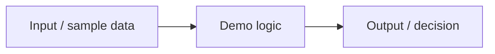

# NN Use Case Name

Short one-paragraph summary of what this use case demonstrates and why it matters commercially.

## Problem

What commercial or operational e-commerce growth problem does this address?

## Expertise Signal

What professional judgment does this demo make visible? (What to measure, automate, trust, reject, or which trade-off matters.)

## Business Impact

Business impact in plain language or approximate euros / time saved.

## Architecture



## Quickstart

One command from a fresh clone:

```bash
# e.g. npm start  |  python app.py  |  docker compose up
```

## How It Works

Brief walkthrough of the key steps and the design choices that matter.

## Trade-offs & Scale

Name a real constraint in this demo and what would change at production scale. (Generic "could scale with cloud/Kubernetes" text is not acceptable.)

## Blog Links

- [Article title](https://aaronwest.de/blog)

## Screenshot


